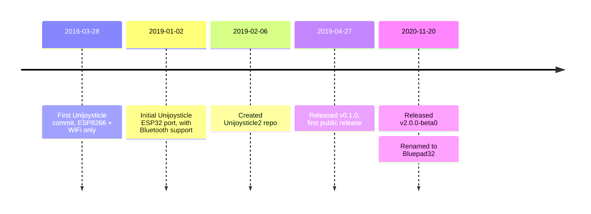

# FAQ

## What are the supported boards?

???+ note "TL;DR"

    Answer: [Pico W][pico_w] and [ESP32-family][esp32_family]

The Pico W and the ESP32 processors that have Bluetooth (E.g.: ESP32, ESP32-S3, ESP32-C3) are supported.

For ESP32, Bluepad32 can run in:

- the main processor, like in the [Espressif ESP32-DevKitC][espressif_esp32_devkitc]
- or in coprocessor modules, like [Adafruit AirLift][airlift] modules, or [Arduino NINA-W102 based][nina_module]
  boards.

If you want to know whether a certain ESP32-based board is supported, it is safe to assume
that if the board is supported by regular Arduino, then it is supported by Bluepad32.

[pico_w]: https://www.raspberrypi.com/documentation/microcontrollers/raspberry-pi-pico.html

[esp32_family]: https://www.espressif.com/en/products/modules

[espressif_esp32_devkitc]: https://docs.espressif.com/projects/esp-idf/en/latest/esp32/hw-reference/esp32/get-started-devkitc.html

[airlift]: https://www.adafruit.com/product/4201

[nina_module]: https://store.arduino.cc/products/arduino-nano-rp2040-connect

## How to pair just one controller to one particular board?

???+ note "TL;DR"

    Answer: Use BT allowlist.

Scenario: You want to control eight robots, each with one controller.
Controller A should only control robot A, controller B should only control robot B, and so on.

There are two ways to do it:

- Programmatically using the `uni_bt_allowlist` API
- Manually from the USB console

### Using `uni_bt_allowlist` API

One way to do it is by using the `uni_bt_allowlist` API.

The most important APIs are:

- `bool uni_bt_allowlist_add_addr(bd_addr_t addr);`: add BT address to the allowlist
- `void uni_bt_allowlist_set_enabled(bool enabled);`: enables the allowlist.

To see the rest of the APIs see: [uni_bt_allowlist.h]

Complete example:

```c++
// Arduino sketch
// Include Uni API.
#include <uni.h>

// The address of the gamepad that is allowed to connect.
// You can add up to four entries.
static const char * controller_addr_string = "00:11:22:33:44:55";

void setup() {
    // Somewhere in your "setup" add the following lines:
    bd_addr_t controller_addr;

    // Parse human-readable Bluetooth address.
    sscanf_bd_addr(controller_addr_string, controller_addr);

    // Notice that this address will be added in the Non-volatile-storage (NVS).
    // If the device reboots, the address will still be stored.
    // Adding a duplicate value will do nothing.
    // You can add up to four entries in the allowlist.
    uni_bt_allowlist_add_addr(controller_addr);

    // Finally, enable the allowlist.
    // Similar to the "add_addr", its value gets stored in the NVS.
    uni_bt_allowlist_set_enabled(true);
}
```

### Using allowlist commands from the USB console

!!! Note

    The USB console is ONLY avaialble in the [Arduino ESP-IDF Template][arduino_esp_idf_template] project,
    in the [ESP-IDF raw API][esp_idf_raw], and in [Unijoysticle][unijoysticle].

To access the USB Console, use your favorite serial terminal a do:

```
# Port might change
# If you prefer minicom, just do 'minicom -D /dev/ttyUSB0'
tio /dev/ttyUSB0
```

And once you are in the console type `help`

```
bp32> help
```

The allowlist commands are:

- `allowlist_list`: List allowlist addresses
- `allowlist_add <bt addr`: Add address to the allowlist
- `allowlist_remove <bt addr`: Remove address from the allowlist
- `allowlist_enable <0 | 1 >`: Whether allowlist should be enforced

See video for further details:

[](https://asciinema.org/a/649043)

Values are stored in Non-Volatile-Storage (NVS).
This means that if you reset the ESP32, the allowlist entries, and whether it is enabled will persist the reset.

[arduino_esp_idf_template]: https://bluepad32.readthedocs.io/en/latest/plat_arduino/#option-b-use-esp-idf-template-project

[esp_idf_raw]: https://github.com/ricardoquesada/bluepad32/tree/main/examples/esp32

[unijoysticle]: https://bluepad32.readthedocs.io/en/latest/plat_unijoysticle/


[uni_bt_allowlist.h]: https://github.com/ricardoquesada/bluepad32/blob/main/src/components/bluepad32/include/bt/uni_bt_allowlist.h

## How to detect when a gamepad is out of range?

???+ note "TL;DR"

    Answer: Add a "if don't receive data in 5 seconds, disconnect"

Let's assume that you are controlling a car with the gamepad.
If the car goes too far away, it won't receive gamepad data because Bluetooth was not designed a long-range protocol."

| BR/EDR           | BLE             |
|------------------|-----------------|
| up to 100 meters | up to 50 meters |

So when the car is outside the range, it won't even receive a "disconnect" event.
Eventually, the Bluetooth stack will figure out that the connection was disconnected and will close it
But it might take up to 20 seconds or more.

So, in your code you should do something like the following:

```c++
// Arduino Sketch

void processControllers() {
    for (auto myController : myControllers) {
        if (myController && myController->isConnected()) {
            if (myController->hasData()) {
                // process controller
                processGamepad(myController);
                lastUpdate = millis();
            } else {
                // No data received from the controller.
                if ((millis() - lastUpdate) > 5000) {
                    // If no data received in more than 5000 milliseconds, do something.
                    stopCar();
                    myController->disconnect();
                }
            }
        }
    }
}

void loop() {
    bool dataUpdated = BP32.update();
    if (dataUpdated) {
        processControllers();
    }

    vTaskDelay(1);
}

```

Check [GitHub Issue #42][github_issue_42] for more details.

[github_issue_42]: https://github.com/ricardoquesada/bluepad32/issues/42

## Could you add support for my unsupported controller?

???+ note "TL;DR"

    Answer: We'll do our best.

First of all, double-check that the controller is not already supported:

* [Supported gamepads][supported_gamepads] :material-gamepad-variant:
* [Supported mice][supported_mice] :material-mouse:
* [Supported keyboards][supported_keyboards] :material-keyboard:

If it is not there, and you want us to support it, contact us (Send us a Private Message in
[Discord][discord_server] :simple-discord:, or [file a feature request][github_bug] :simple-github:).

The way it works is:

* You send us a link to the controller that is not supported, like the Amazon or AliExpress link.
* You send us via [PayPal][paypal] :simple-paypal:, [Ko-fi][kofi] :simple-kofi:, [Venmo][venmo] :simple-venmo:, or even
  an Amazon gift card, the cost of the gamepad + shipping to the US.
* We purchase it, and we will do our best to support it.
  But we don't guarantee anything.
  So many things can go wrong, especially with low-cost clones where many features are not implemented.

[discord_server]: https://discord.gg/r5aMn6Cw5q

[github_bug]: https://github.com/ricardoquesada/bluepad32/issues

[kofi]: https://ko-fi.com/ricardoquesada

[paypal]: https://www.paypal.com/paypalme/RicardoQuesada

[supported_gamepads]: ../supported_gamepads/

[supported_gamepads]: ../supported_gamepads/

[supported_keyboards]: ../supported_keyboards/

[supported_keyboards]: ../supported_keyboards/

[supported_mice]: ../supported_mice/

[supported_mice]: ../supported_mice/

[venmo]: https://account.venmo.com/u/Ricardo-Quesada

## Why does the internal Bluepad32 API use `uni` as prefix?

???+ note "TL;DR"

    Answer: Legacy

The [Unijoysticle2][unijoysticle2] project included both the hardware and the firmware.
In November 2020 I decided to port the Unijoysticle firmware to Adafruit AirLift module.

During the port and I had the decouple the firmware from the Unijoysticle2 hardware: I had re-design the architecture,
but to avoid too many changes I decided to keep using the old `uni` prefix.

The Bluepad32 Arduino API does NOT use the `uni` prefix since I created it from scratch, without the need to maintain
backward compatibility.

## Why is BTstack being used as the Bluetooth stack?

???+ note "TL;DR"

    Answer: There were no alternatives back in 2019

When I started Bluepad32 back in January 2019, there was no Bluetooth Classic (BR/EDR) implementation available for
ESP32.

I had two options:

- use [Bluekitchen BTstack][btstack]
- or implement my own

I decided to use BTstack. It turned out to be a good decision:

- Pico W uses BTstack, so porting Bluepad32 to Pico W was fairly straight-forward.
- It supports Posix systems: Beneficial when adding support for a new controller.

[btstack]: https://github.com/bluekitchen/btstack

## Which IDE should I use?

???+ note "TL;DR"

    Answer: The one that makes you more productive.

Use the one that makes you more productive. Sometimes it is the one that you are more familiar with.

Some options are:

* [Arduino IDE][arduino_ide]: good if you are already familiar with Arduino ecosystem.
* [Visual Studio Code][vscode]: good as a generic code editor. Requires to install different plugins to have a good C /
  C++ experience.
* [CLion][clion]: good for advanced C / C++ users.

For me, the best one by far is [CLion][clion]. But your mileage may vary.

[arduino_ide]: https://www.arduino.cc/en/software

[vscode]: https://code.visualstudio.com/

[clion]: https://www.jetbrains.com/clion/

## When was Bluepad32 created?

???+ note "TL;DR"

    Answer: 2019, although the original project started in 2016, and it was renamed to Bluepad32 in 2020.

- Started [Unijoysticle][unijoysticle] project (WiFi gamepad for Commodore 64): [2016-03-28][uni1_first_commit]
- Decided to support Bluetooth in late 2018, the first commit was: [2019-01-02][fw_first_commit]
- Created Unijoysticle2 repo: [2019-02-06][fw_uni2_repo] (copied files from Unijoysticle repo)
- First public release of the firmware v0.1.0: [2019-04-27][fw_first_release]
- Renamed firmware to Bluepad32: [November 2020][fw_as_bluepad32] (hardware was still called Unijoysticle2)



[unijoysticle]: https://retro.moe/unijoysticle

[uni1_first_commit]: https://github.com/ricardoquesada/unijoysticle/commit/fee5182337e055bd20cf549afa70f88fdc3fcf41

[unijoysticle2]: https://retro.moe/unijoysticle2/

[fw_first_commit]: https://github.com/ricardoquesada/unijoysticle/commit/80af0337d93e6646128949ef6d565203eb2a8385

[fw_uni2_repo]: https://github.com/ricardoquesada/unijoysticle2/commit/d99d35b207e9a825bf5de27f2ac5fd602eafd7d4

[fw_first_release]: https://github.com/ricardoquesada/unijoysticle2/releases/tag/release_firmware_v0.1.0

[fw_as_bluepad32]: https://retro.moe/2020/11/24/bluepad32-gamepad-support-for-esp32/
