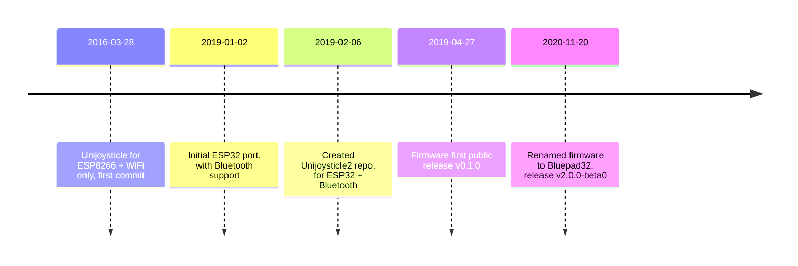

# FAQ

## What are the supported boards ?

TL;DR: [Pico W][pico_w] and [ESP32-family][esp32_family]

The Pico W and the ESP32 processors that have Bluetooth (E.g: ESP32, ESP32-S3, ESP32-C3) are supported.

For ESP32, Bluepad32 can run in:

- the main processor, like in the [Espressif ESP32-DevKitC][espressif_esp32_devkitc]
- or in co-processor modules, like [Adafruit AirLift][airlift] modules, or [Arduino NINA-W102 based][nina_module] boards.

If you want to know whether a certain ESP32-based board is supported, it is safe to assume
that if the board is supported by regular Arduino, then it is supported by Bluepad32.

[pico_w]: https://www.raspberrypi.com/documentation/microcontrollers/raspberry-pi-pico.html
[esp32_family]: https://www.espressif.com/en/products/modules
[espressif_esp32_devkitc]: https://docs.espressif.com/projects/esp-idf/en/latest/esp32/hw-reference/esp32/get-started-devkitc.html
[airlift]: https://www.adafruit.com/product/4201
[nina_module]: https://store.arduino.cc/products/arduino-nano-rp2040-connect

## Why does the internal Bluepad32 API use `uni` as prefix ?

TL;DR: Legacy

The [Unijoysticle2][unijoysticle2] project included both the hardware and the firmware.
In November 2020 I decided to port the Unijoysticle firmware to Adafruit AirLift module.

During the port and I had the decouple the firmware from the Unijoysticle2 hardware: I had re-design the architecture,
but to avoid too many changes I decided to kept using the old `uni` prefix.

The Bluepad32 Arduino API does NOT use the `uni` prefix since I created it from scratch, without the need to maintain
backward compatibility.

## When Bluepad32 was created ?

TL;DR: Project started in 2016, but it was renamed to Bluepad32 in November 2020.

- Started [Unijoysticle][unijoysticle] project (WiFi gamepad for Commodore 64): [2016-03-28][uni1_first_commit]
- Decided to support Bluetooth in late 2018, first commit was: [2019-01-02][fw_first_commit] (done in the Unijoysticle repo)
- Created Unijoysticle2 repo: [2019-02-06][fw_uni2_repo] (copied files from Unijoysticle repo)
- First public release of the firmware v0.1.0: [2019-04-27][fw_first_release]
- Renamed firmware to Bluepad32: [November 2020][fw_as_bluepad32] (hardware was still called Unijoysticle2)

[unijoysticle]: https://retro.moe/unijoysticle
[uni1_first_commit]: https://github.com/ricardoquesada/unijoysticle/commit/fee5182337e055bd20cf549afa70f88fdc3fcf41
[unijoysticle2]: https://retro.moe/unijoysticle2/
[fw_first_commit]: https://github.com/ricardoquesada/unijoysticle/commit/80af0337d93e6646128949ef6d565203eb2a8385
[fw_uni2_repo]: https://github.com/ricardoquesada/unijoysticle2/commit/d99d35b207e9a825bf5de27f2ac5fd602eafd7d4
[fw_first_release]: https://github.com/ricardoquesada/unijoysticle2/releases/tag/release_firmware_v0.1.0
[fw_as_bluepad32]: https://retro.moe/2020/11/24/bluepad32-gamepad-support-for-esp32/

## Why BTstack is being used as the Bluetooth stack instead of ... ?

TL;DR: There were no alternatives back in 2019

I started Bluepad32 in January 2019, although it was not called Bluepad32 back then.
Back then there was not Bluetooth Classic (BR/EDR) implementation available for ESP32.

I had two options:

- use [Bluekitchen BTstack][btstack]
- or implement my own

I decided to use BTstack. It turned out to be a good decision:

- Pico W uses BTstack, so porting Bluepad32 to Pico W was fairly straight-forward.
- It supports Posix systems: very useful when adding support for a new controller.

[btstack]: https://github.com/bluekitchen/btstack