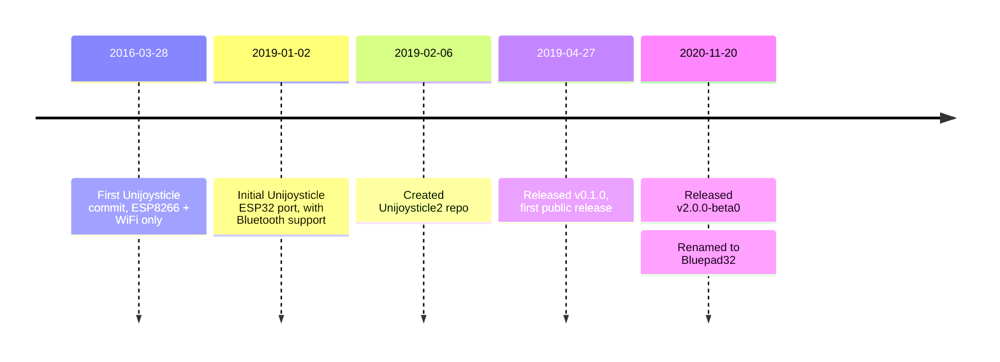

# FAQ

## What are the supported boards?

TL;DR: [Pico W][pico_w] and [ESP32-family][esp32_family]

The Pico W and the ESP32 processors that have Bluetooth (E.g.: ESP32, ESP32-S3, ESP32-C3) are supported.

For ESP32, Bluepad32 can run in:

- the main processor, like in the [Espressif ESP32-DevKitC][espressif_esp32_devkitc]
- or in co-processor modules, like [Adafruit AirLift][airlift] modules, or [Arduino NINA-W102 based][nina_module]
  boards.

If you want to know whether a certain ESP32-based board is supported, it is safe to assume
that if the board is supported by regular Arduino, then it is supported by Bluepad32.

[pico_w]: https://www.raspberrypi.com/documentation/microcontrollers/raspberry-pi-pico.html

[esp32_family]: https://www.espressif.com/en/products/modules

[espressif_esp32_devkitc]: https://docs.espressif.com/projects/esp-idf/en/latest/esp32/hw-reference/esp32/get-started-devkitc.html

[airlift]: https://www.adafruit.com/product/4201

[nina_module]: https://store.arduino.cc/products/arduino-nano-rp2040-connect

## Why does the internal Bluepad32 API use `uni` as prefix?

TL;DR: Legacy

The [Unijoysticle2][unijoysticle2] project included both the hardware and the firmware.
In November 2020 I decided to port the Unijoysticle firmware to Adafruit AirLift module.

During the port and I had the decouple the firmware from the Unijoysticle2 hardware: I had re-design the architecture,
but to avoid too many changes I decided to keep using the old `uni` prefix.

The Bluepad32 Arduino API does NOT use the `uni` prefix since I created it from scratch, without the need to maintain
backward compatibility.

## How to detect when a gamepad is out of range?

TL;DR: Add a "if don't receive data in 5 seconds, disconnect"

Let's assume that you are controlling a car with the gamepad.
If the car goes too far away, it won't receive gamepad data because Bluetooth was not designed a long-range protocol."

| BR/EDR           | BLE             |
|------------------|-----------------|
| up to 100 meters | up to 50 meters |

So when the car is outside the range, it won't even receive a "disconnect" event.
Eventually, the Bluetooth stack will figure out that the connection was disconnected and will close it
But it might take up to 20 seconds or more.

So, in your code you should do something like the following:

```c++
// Arduino Sketch

void loop() {
    bool dataUpdated = BP32.update();
    if (dataUpdated) {
        processControllers();

        // Update the last time you received data
        lastUpdate = millis();
    } else {
        if ((millis() - lastUpdate) > 5000) {
            // If no data received in more than 5000 milliseconds, do something
            stopCar();
        }
    }

    vTaskDelay(1);
}
```

If you have multiple controllers connected, and you want to check for just one controller,
then you can do something like the following:

```c++
// Arduino Sketch

// Function called from 'loop()`.
void processControllers() {
    for (auto myController : myControllers) {
        if (myController && myController->isConnected()) {
            if (myController->hasData()) {
                // process controller
                processGamepad(myController);
                lastUpdate = millis();
            } else {
                // No data received from the controller.
                if ((millis() - lastUpdate) > 5000) {
                    // If no data received in more than 5000 milliseconds, do something.
                    stopCar();
                    myController->disconnect();
                }
            }
        }
    }
}
```

Check [GitHub Bug #42][github_issue_42] for more details.

[github_issue_42]: https://github.com/ricardoquesada/bluepad32/issues/42

## Why is BTstack being used as the Bluetooth stack?

TL;DR: There were no alternatives back in 2019

When I started Bluepad32 back in January 2019, there was no Bluetooth Classic (BR/EDR) implementation available for
ESP32.

I had two options:

- use [Bluekitchen BTstack][btstack]
- or implement my own

I decided to use BTstack. It turned out to be a good decision:

- Pico W uses BTstack, so porting Bluepad32 to Pico W was fairly straight-forward.
- It supports Posix systems: Beneficial when adding support for a new controller.

[btstack]: https://github.com/bluekitchen/btstack

## When was Bluepad32 created?

TL;DR: 2019, although the original project started in 2016, and it was renamed to Bluepad32 in 2020.

- Started [Unijoysticle][unijoysticle] project (WiFi gamepad for Commodore 64): [2016-03-28][uni1_first_commit]
- Decided to support Bluetooth in late 2018, the first commit was: [2019-01-02][fw_first_commit]
- Created Unijoysticle2 repo: [2019-02-06][fw_uni2_repo] (copied files from Unijoysticle repo)
- First public release of the firmware v0.1.0: [2019-04-27][fw_first_release]
- Renamed firmware to Bluepad32: [November 2020][fw_as_bluepad32] (hardware was still called Unijoysticle2)



[unijoysticle]: https://retro.moe/unijoysticle

[uni1_first_commit]: https://github.com/ricardoquesada/unijoysticle/commit/fee5182337e055bd20cf549afa70f88fdc3fcf41

[unijoysticle2]: https://retro.moe/unijoysticle2/

[fw_first_commit]: https://github.com/ricardoquesada/unijoysticle/commit/80af0337d93e6646128949ef6d565203eb2a8385

[fw_uni2_repo]: https://github.com/ricardoquesada/unijoysticle2/commit/d99d35b207e9a825bf5de27f2ac5fd602eafd7d4

[fw_first_release]: https://github.com/ricardoquesada/unijoysticle2/releases/tag/release_firmware_v0.1.0

[fw_as_bluepad32]: https://retro.moe/2020/11/24/bluepad32-gamepad-support-for-esp32/

