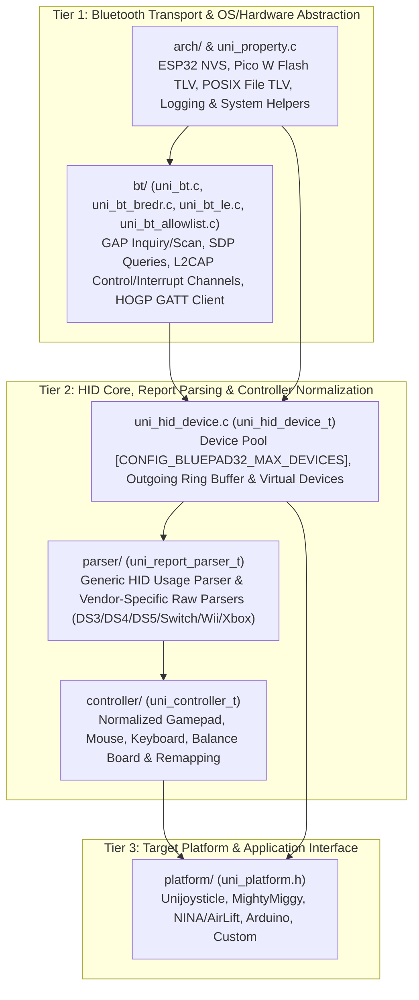
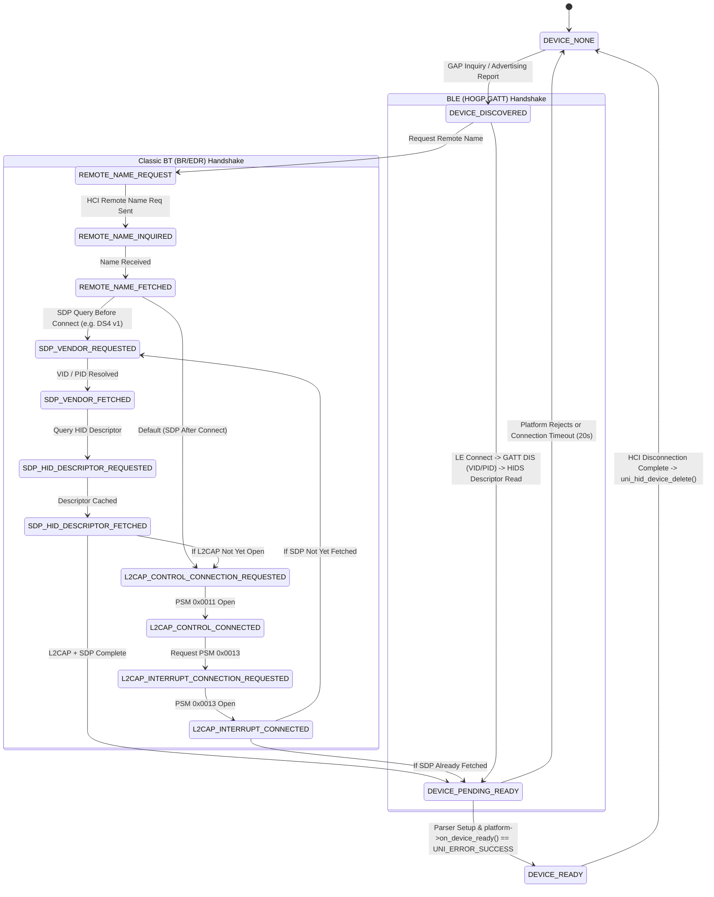
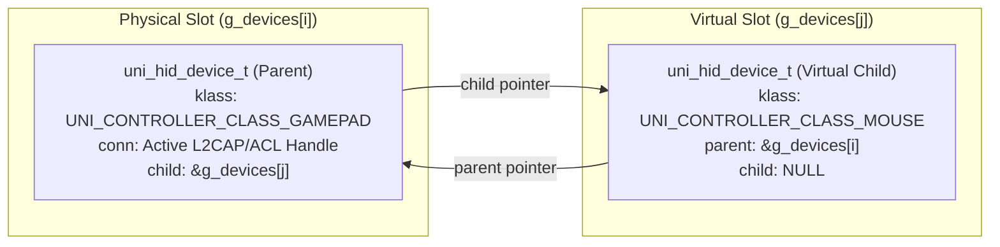

# Bluepad32 Architecture

Bluepad32 is a modular, portable Bluetooth HID Host firmware component written in C99 on top of the [BTstack][btstack] Bluetooth stack. It is architected so that the core Bluetooth protocol handling, HID descriptor/report parsing, and controller normalization remain 100% decoupled from target hardware, real-time operating systems, and host interfaces (retro consoles, Arduino, SPI co-processors, or POSIX desktops).

```
  ┌──────────────┐ ┌──────────┐ ┌──────────┐ ┌─────────────┐ ┌──────────┐
  │              │ │  NINA /  │ │          │ │             │ │          │
  │ Unijoysticle │ │  AirLift │ │ Arduino  │ │ MightyMiggy │ │ Custom   │      Platforms
  │              │ │          │ │          │ │             │ │          │
  └────────┬─────┘ └────┬─────┘ └────┬─────┘ └─────┬───────┘ └───┬──────┘
           │            │            │             │             │
           │            │            │             │             │
      ┌────▼────────────▼────────────▼─────────────▼─────────────▼─┐
      │                                                            │
      │                                                            │
      │                                                            │           Firmware
      │                          Bluepad32                         │
  ┌───┤                                                            │
  │   │                                                            │
  │   │                                                            │
  │   └─────┬──────────────────┬──────────────┬─────────────────┬──┘
  │         │                  │              │                 │
  │         │                  │              │                 │
  │         │   ┌──────────────▼────────────┐ │                 │
  │         │   │                           │ │                 │
  │         │   │           BTstack         ├─┼──────────────┐  │              Bluetooth Stack
  │         │   │                           │ │              │  │
  │         │   └────┬──────┬─────────┬─────┘ │              │  │
  │         │        │      │         │       │              │  │
  │         │        │      │         │       │              │  │
  │      ┌──▼────────▼───┐  │         │       │              │  │
  │      │               │  │         │       │              │  │
  │      │   FreeRTOS    │  │         │       │              │  │
  │      │               │  │         │       │              │  │
  │      └──────┬────────┘  │         │       │              │  │
  │             │           │         │       │              │  │
┌─▼─────────────▼───────────▼─┐ ┌─────▼───────▼──┐ ┌─────────▼──▼──────────┐
│                             │ │                │ │                       │
│            ESP-IDF          │ │    Pico SDK    │ │    Posix / libusb     │    Operating System
│                             │ │                │ │                       │
└────────────────┬────────────┘ └────────┬───────┘ └───────────┬───────────┘
                 │                       │                     │
                 │                       │                     │
┌────────────────▼────────────┐ ┌────────▼───────┐ ┌───────────▼───────────┐
│                             │ │                │ │                       │
│                             │ │                │ │                       │
│         ESP32 family        │ │  Raspberry Pi  │ │         Posix         │
│                             │ │                │ │                       │     Hardware
│     ESP32, ESP32-S3, etc    │ │  Pico W family │ │      Linux, macOS     │
│                             │ │                │ │                       │
│                             │ │                │ │                       │
└─────────────────────────────┘ └────────────────┘ └───────────────────────┘
```

---

## 1. Three-Tier & Six-Subsystem Layer Breakdown

Within `src/components/bluepad32/`, the firmware is organized into six strictly decoupled subsystems spanning three architectural tiers:



| Tier | Subsystem Directory / Module | Core Responsibilities |
| :--- | :--- | :--- |
| **Tier 1: Transport & Arch** | `arch/` & `uni_property.c` | Implements OS/MCU-specific primitives (`uni_system`, `uni_log`) and non-volatile key-value storage (`uni_property_esp32.c`, `uni_property_pico.c`, `uni_property_posix.c`). |
| **Tier 1: Transport & Arch** | `bt/` (`uni_bt*.c`) | Wraps BTstack HCI, GAP, SDP, L2CAP, and BLE GATT client state machines. Isolates all Bluetooth-specific protocol logic from the rest of Bluepad32. |
| **Tier 2: Core & Parsing** | `uni_hid_device.c` | Manages the static pool of `uni_hid_device_t` slots (`CONFIG_BLUEPAD32_MAX_DEVICES`), connection timeouts, outgoing report circular buffers (`uni_circular_buffer_t`), and composite `parent`/`child` virtual device pairs. |
| **Tier 2: Core & Parsing** | `parser/` (`uni_hid_parser*.c`) | Translates incoming Bluetooth HID reports into normalized controller structs via a pluggable `uni_report_parser_t` virtual function table (`setup`, `init_report`, `parse_usage`, `parse_input_report`, `parse_feature_report`) and dispatches haptic/LED output reports. |
| **Tier 2: Core & Parsing** | `controller/` (`uni_controller*.c`) | Defines canonical hardware-agnostic representations (`uni_gamepad_t`, `uni_mouse_t`, `uni_keyboard_t`, `uni_balance_board_t`), button/axis remapping (`uni_gamepad_remap`), and retro joystick converters (`uni_joystick.c`). |
| **Tier 3: Platform** | `platform/` (`uni_platform*.c`) | Connects normalized controller events to the physical world via the `struct uni_platform` callback interface (`on_init_complete`, `on_device_connected`, `on_device_ready`, `on_controller_data`, `on_device_disconnected`, `on_oob_event`). |

---

## 2. Bluetooth Connection State Machine (`uni_bt_conn_state_t`)

Bluepad32 supports both **Bluetooth Classic (`BR/EDR`)** HID devices (DualShock 3/4, DualSense, Nintendo Switch Pro, Wii Remote, Xbox Wireless 1708) and **Bluetooth Low Energy (`BLE` / HOGP)** HID devices (Xbox Series X|S, Stadia, Steam Controller, BLE mice/keyboards).

Every `uni_hid_device_t` embeds a `uni_bt_conn_t conn` structure that tracks the device's progression through the `uni_bt_conn_state_t` state machine from initial discovery to `UNI_BT_CONN_STATE_DEVICE_READY`.



### Key HandshakeNuances (`uni_sdp_query_type_t`)
* **`SDP_QUERY_AFTER_CONNECT` (Default)**: Most Classic BT controllers (such as Nintendo Switch Pro) expect the L2CAP Control (`PSM 0x0011`) and Interrupt (`PSM 0x0013`) channels to be established *before* SDP queries for Vendor/Product ID (`0x0201`/`0x0202`) and the HID Report Descriptor (`0x0206`).
* **`SDP_QUERY_BEFORE_CONNECT`**: First-generation Sony DualShock 4 controllers require the SDP query to complete *before* opening L2CAP channels, or the controller drops the connection.
* **`SDP_QUERY_NOT_NEEDED`**: Controllers identified directly by their inquiry name or Class of Device (or BLE controllers whose VID/PID and report map are discovered via GATT Device Information Service `0x180A` and HID Service `0x1812`) bypass Classic SDP entirely.

---

## 3. Dual-Mode HID Report Parsing & Virtual Device Bifurcation

### 3.1 Dual-Mode Parser Dispatch (`uni_hid_parse_input_report`)

Once a device reaches `DEVICE_PENDING_READY`, `uni_hid_device_set_ready()` selects a `uni_report_parser_t` implementation based on `(vendor_id, product_id)` and controller type. When an input report arrives on the L2CAP Interrupt channel (or BLE HIDS notification), `uni_hid_parse_input_report()` executes a four-stage pipeline:

1. **`report_parser.init_report(d)`**: Resets transient per-frame state before decoding the packet.
2. **Mode A — Raw Struct Parser (`report_parser.parse_input_report(d, report, report_len)`)**:
   * Used by controllers with complex, proprietary, or high-rate binary reports (Sony DualShock 3/4, DualSense, Nintendo Switch Pro/Joy-Con, Wii Remote/Balance Board, Xbox One).
   * Directly validates report lengths, casts the payload to packed C structures, applies factory gyro/accelerometer calibration (`parse_feature_report`), and populates `d->controller`.
3. **Mode B — Descriptor-Driven Usage Parser (`report_parser.parse_usage(d, &globals, usage_page, usage, value)`)**:
   * Used by standard HID gamepads, keyboards, mice, Android, 8BitDo, and Stadia controllers.
   * Bluepad32 iterates through the cached HID Report Descriptor using `btstack_hid_parser_init()`, extracting `(logical_minimum, logical_maximum, usage_page, usage, value)` tuples and normalizing axes (`[-511, 512]`) and pedals (`[0, 1020]`) via `uni_hid_parser_process_axis()` and `uni_hid_parser_process_pedal()`.
4. **Platform Delivery**: Forwards the normalized `uni_controller_t` to `uni_get_platform()->on_controller_data(d, &d->controller)`.

### 3.2 Composite Controllers & Virtual Devices (`parent` / `child`)

Certain physical Bluetooth controllers expose multiple logical input devices within a single wireless connection. For example, **Sony DualShock 4** and **DualSense** controllers combine a full gamepad with an integrated multi-touch capacitive touchpad that acts as a mouse.



* **Creation (`uni_hid_device_create_virtual`)**: During `setup()`, if virtual devices are enabled (`uni_virtual_device_is_enabled()`), the parent parser allocates a second `uni_hid_device_t` slot from `g_devices[]`, initializes it via `uni_hid_device_init()`, copies the parent's metadata (`vendor_id`, `product_id`, `btaddr`), and links `parent->child = child` and `child->parent = parent`.
* **Data Routing**: When the parent parser decodes touchpad packets inside `parse_input_report()`, it writes mouse deltas and button states into `d->child->controller.mouse` and invokes `uni_hid_device_process_controller(d->child)` so platforms receive independent `UNI_CONTROLLER_CLASS_GAMEPAD` and `UNI_CONTROLLER_CLASS_MOUSE` events.
* **Lifecycle & Teardown Safety (`uni_hid_device_delete`)**:
  * Deleting a parent device recursively deletes `d->child` and sets `d->child = NULL`.
  * Deleting a virtual child device explicitly unlinks `d->parent->child = NULL` so the parent never retains a dangling pointer to a recycled slot.
  * Before zeroing any device slot (`uni_hid_device_init`), `uni_hid_device_delete()` unregisters all three intrusive BTstack timers (`connection_timer`, `inquiry_remote_name_timer`, and `misc_button_delay_timer`) from the global BTstack run-loop linked list.

---

## 4. BTstack Single-Threaded Run-Loop & `CMD_CALLBACK_MAX` Semantics

Neither BTstack nor Bluepad32 is re-entrant or internally mutex-locked. All Bluetooth packet processing, timer expirations, HID parsing, and platform callbacks execute sequentially on a single **BTstack Run-Loop Thread** (Core 0 task on ESP32, main run loop on Pico W and POSIX).

To allow external threads (such as an Arduino `loop()` running on ESP32 Core 1, a FreeRTOS worker task, or an SPI interrupt handler in NINA/AirLift) to invoke Bluetooth operations safely without data races:

1. **`*_safe` Asynchronous Dispatch**: Functions suffixed with `_safe` (e.g., `uni_bt_start_scanning_and_autoconnect_safe()`, `uni_bt_del_keys_safe()`, `uni_bt_disconnect_device_safe()`) do **not** touch BTstack state directly.
2. **Pre-Allocated Registration Ring Buffer (`CMD_CALLBACK_MAX = 8`)**:
   * `uni_bt.c` maintains a static circular pool of 8 `btstack_context_callback_registration_t` structures (`cmd_callback_registration[CMD_CALLBACK_MAX]`).
   * Each `_safe()` call claims the next slot (`cmd_callback_idx = (cmd_callback_idx + 1) % CMD_CALLBACK_MAX`), packs the command ID and 16-bit argument into `cmd->context`, and queues it onto the BTstack run loop via `btstack_run_loop_execute_on_main_thread(cmd)`.
   * **Rate-Limiting Invariant**: Because BTstack chains `btstack_context_callback_registration_t` nodes intrusively until the run loop drains them, external tasks must not burst more than `CMD_CALLBACK_MAX` (`8`) concurrent `_safe()` calls before the BTstack thread processes a run-loop tick.

---

## 5. Non-Volatile Property System (`uni_property`) & Allowlist Persistence

Bluepad32 provides a unified property abstraction (`uni_property.h` / `uni_property.c`) for storing persistent configuration keys (`bp.bt.allow_en`, `bp.bt.allowlist`, `bp.ble.enabled`, `bp.gap.*`, `bp.mouse.scale`, `bp.virt_dev_en`) across reboots:

* **Architecture Backends (`arch/`)**:
  * **ESP32 (`uni_property_esp32.c`)**: Stores properties in an ESP-IDF Non-Volatile Storage (`nvs_flash`) namespace (`"bp32"`).
  * **Raspberry Pi Pico W (`uni_property_pico.c`)**: Uses BTstack's Flash Bank TLV (`btstack_tlv_flash_bank`) in the final sectors of onboard QSPI flash.
  * **POSIX (`uni_property_posix.c`)**: Uses BTstack's file-backed TLV (`btstack_tlv_posix`, stored at `/tmp/btstack_tlv.tlv`) with lazy `get_or_create_instance_tlv()` initialization and full support for boolean, integer (`u8`, `u32`), float (`f32`), and string (`UNI_PROPERTY_TYPE_STRING`) tags.
* **Allowlist Boot vs. Runtime Persistence (`uni_bt_allowlist.c`)**:
  * On boot (`uni_bt_allowlist_init()`), `update_allowlist_from_property()` clears the in-memory `addr_allow_list[]` array (`memset`) and populates parsed MAC addresses via `add_addr_internal(addr, /*persist=*/false)`. Suppressing NVS/TLV writes during boot prevents flash wear and avoids overwriting the backing static string buffer while `strtok_r` is still tokenizing it.
  * Runtime mutations (`uni_bt_allowlist_add_addr()`, `uni_bt_allowlist_remove_addr()`, `uni_bt_allowlist_remove_all()`) reject the all-zero MAC address (`00:00:00:00:00:00`) and immediately serialize the updated MAC list back to `UNI_PROPERTY_IDX_ALLOWLIST_LIST`.

[btstack]: https://github.com/bluekitchen/btstack

