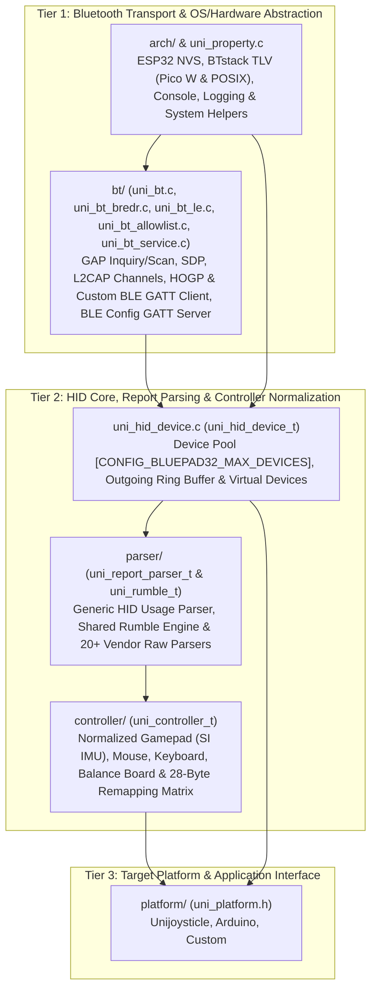
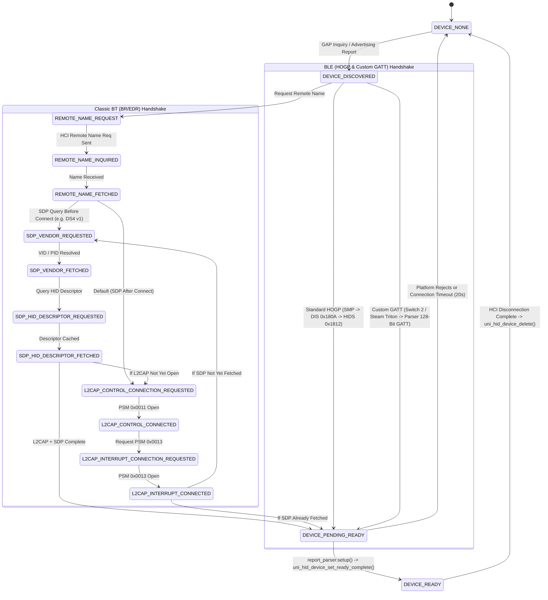
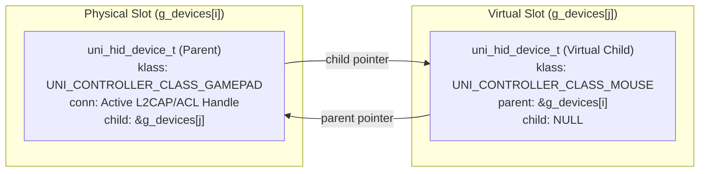

# Bluepad32 Architecture

Bluepad32 is a modular Bluetooth HID Host firmware component in C11 on top of
the [BTstack][btstack] Bluetooth stack. This architecture decouples core
Bluetooth protocols, HID report parsers, and controller normalization from
target hardware, operating systems, and host interfaces.

```
  ┌──────────────┐ ┌──────────┐ ┌──────────┐
  │              │ │          │ │          │
  │ Unijoysticle │ │ Arduino  │ │ Custom   │      Platforms
  │              │ │          │ │          │
  └────────┬─────┘ └────┬─────┘ └───┬──────┘
           │            │           │
           │            │           │
      ┌────▼────────────▼───────────▼───────┐
      │                                     │
      │                                     │
      │                                     │           Firmware
      │              Bluepad32              │
  ┌───┤                                     │
  │   │                                     │
  │   │                                     │
  │   └─────┬──────────────────┬────────────┘
  │         │                  │
  │         │                  │
  │         │   ┌──────────────▼────────────┐
  │         │   │                           │
  │         │   │           BTstack         ├───────────────┐    Bluetooth Stack
  │         │   │                           │               │
  │         │   └────┬──────┬─────────┬─────┘               │
  │         │        │      │         │                     │
  │         │        │      │         │                     │
  │      ┌──▼────────▼───┐  │         │                     │
  │      │               │  │         │                     │
  │      │   FreeRTOS    │  │         │                     │
  │      │               │  │         │                     │
  │      └──────┬────────┘  │         │                     │
  │             │           │         │                     │
┌─▼─────────────▼───────────▼─┐ ┌─────▼──────────┐ ┌────────▼──────────────┐
│                             │ │                │ │                       │
│            ESP-IDF          │ │    Pico SDK    │ │    Posix / libusb     │    Operating System
│                             │ │                │ │                       │
└────────────────┬────────────┘ └────────┬───────┘ └───────────┬───────────┘
                 │                       │                     │
                 │                       │                     │
┌────────────────▼────────────┐ ┌────────▼───────┐ ┌───────────▼───────────┐
│                             │ │                │ │                       │
│                             │ │                │ │                       │
│         ESP32 family        │ │  Raspberry Pi  │ │         Posix         │
│                             │ │                │ │                       │     Hardware
│     ESP32, ESP32-S3, etc    │ │  Pico W family │ │      Linux, macOS     │
│                             │ │                │ │                       │
│                             │ │                │ │                       │
└─────────────────────────────┘ └────────────────┘ └───────────────────────┘
```

---

## 1. Three-Tier and Six-Subsystem Layer Breakdown

The `src/components/bluepad32/` directory contains six decoupled subsystems
across three architectural tiers:


```mermaid
flowchart TB
    subgraph Tier3["Tier 3: Target Platform & Application Interface"]
        PLAT["platform/ (uni_platform.h)<br/>Unijoysticle, Arduino, Custom"]
    end

    subgraph Tier2["Tier 2: HID Core, Report Parsing & Controller Normalization"]
        CTL["controller/ (uni_controller_t)<br/>Normalized Gamepad (SI IMU), Mouse, Keyboard, Balance Board & 28-Byte Remapping Matrix"]
        PAR["parser/ (uni_report_parser_t & uni_rumble_t)<br/>Generic HID Usage Parser, Shared Rumble Engine & 20+ Vendor Raw Parsers"]
        DEV["uni_hid_device.c (uni_hid_device_t)<br/>Device Pool [CONFIG_BLUEPAD32_MAX_DEVICES], Outgoing Ring Buffer & Virtual Devices"]
    end

    subgraph Tier1["Tier 1: Bluetooth Transport & OS/Hardware Abstraction"]
        BT["bt/ (uni_bt.c, uni_bt_bredr.c, uni_bt_le.c, uni_bt_allowlist.c, uni_bt_service.c)<br/>GAP Inquiry/Scan, SDP, L2CAP Channels, HOGP & Custom BLE GATT Client, BLE Config GATT Server"]
        ARCH["arch/ & uni_property.c<br/>ESP32 NVS, BTstack TLV (Pico W & POSIX), Console, Logging & System Helpers"]
    end

    BT --> DEV
    ARCH --> BT
    ARCH --> DEV
    DEV --> PAR
    PAR --> CTL
    CTL --> PLAT
    DEV --> PLAT
```

| Tier | Subsystem Directory / Module | Core Responsibilities |
| :--- | :--- | :--- |
| **Tier 1: Transport & Arch** | `arch/` & `uni_property.c` | Implements OS and MCU primitives (`uni_system`, `uni_log`, `uni_console`) and non-volatile storage backends (`uni_property_esp32.c`, `uni_property_btstack_tlv.c`). |
| **Tier 1: Transport & Arch** | `bt/` (`uni_bt*.c`) | Wraps BTstack HCI, GAP, SDP, L2CAP, BLE GATT client state machines, and the companion BLE GATT configuration server (`uni_bt_service.c`). |
| **Tier 2: Core & Parsing** | `uni_hid_device.c` | Manages the static `uni_hid_device_t` pool (`CONFIG_BLUEPAD32_MAX_DEVICES`), connection timers, shared rumble state (`uni_rumble_t`), outgoing ring buffers, and `parent`/`child` virtual devices. |
| **Tier 2: Core & Parsing** | `parser/` (`uni_hid_parser*.c`) | Translates HID reports into normalized structs via `uni_report_parser_t` (`setup`, `deinit`, `init_report`, `parse_usage`, `parse_input_report`, `parse_feature_report`, `device_extra_info`) and sends output reports. |
| **Tier 2: Core & Parsing** | `controller/` (`uni_controller*.c`) | Defines normalized structs (`uni_gamepad_t`, `uni_mouse_t`, `uni_keyboard_t`, `uni_balance_board_t`), the 28-byte remapping matrix (`uni_gamepad_mappings_t`), and retro converters (`uni_joystick.c`, `uni_mouse_quadrature.c`). |
| **Tier 3: Platform** | `platform/` (`uni_platform*.c`) | Delivers normalized controller events to the host application through the `struct uni_platform` callback interface. |

---

## 2. Bluetooth Connection State Machine (`uni_bt_conn_state_t`)

Bluepad32 supports three Bluetooth transport and GATT profiles:

* **Bluetooth Classic (`BR/EDR`)**: Supports DualShock 3, DualShock 4,
    DualSense, Nintendo Switch Pro, Wii Remote, and Xbox Wireless 1708.
* **Standard Bluetooth Low Energy (`BLE` / HOGP `0x1812`)**: Supports Xbox
    Series X|S, Stadia, Steam Controller, SInput BLE, and BLE mice and
    keyboards.
* **Custom 128-Bit BLE GATT (Non-HOGP)**: Supports Nintendo Switch 2
    (`uni_hid_parser_switch2.c`) and Steam Controller 2026 "Triton"
    (`uni_hid_parser_steam_triton.c`).

Each `uni_hid_device_t` embeds a `uni_bt_conn_t conn` struct. This struct
tracks the device state in `uni_bt_conn_state_t` from discovery to
`UNI_BT_CONN_STATE_DEVICE_READY`.


```mermaid
stateDiagram-v2
    [*] --> DEVICE_NONE
    DEVICE_NONE --> DEVICE_DISCOVERED : GAP Inquiry / Advertising Report

    state "Classic BT (BR/EDR) Handshake" as BREDR {
        DEVICE_DISCOVERED --> REMOTE_NAME_REQUEST : Request Remote Name
        REMOTE_NAME_REQUEST --> REMOTE_NAME_INQUIRED : HCI Remote Name Req Sent
        REMOTE_NAME_INQUIRED --> REMOTE_NAME_FETCHED : Name Received

        REMOTE_NAME_FETCHED --> SDP_VENDOR_REQUESTED : SDP Query Before Connect (e.g. DS4 v1)
        REMOTE_NAME_FETCHED --> L2CAP_CONTROL_CONNECTION_REQUESTED : Default (SDP After Connect)

        SDP_VENDOR_REQUESTED --> SDP_VENDOR_FETCHED : VID / PID Resolved
        SDP_VENDOR_FETCHED --> SDP_HID_DESCRIPTOR_REQUESTED : Query HID Descriptor
        SDP_HID_DESCRIPTOR_REQUESTED --> SDP_HID_DESCRIPTOR_FETCHED : Descriptor Cached

        L2CAP_CONTROL_CONNECTION_REQUESTED --> L2CAP_CONTROL_CONNECTED : PSM 0x0011 Open
        L2CAP_CONTROL_CONNECTED --> L2CAP_INTERRUPT_CONNECTION_REQUESTED : Request PSM 0x0013
        L2CAP_INTERRUPT_CONNECTION_REQUESTED --> L2CAP_INTERRUPT_CONNECTED : PSM 0x0013 Open
        L2CAP_INTERRUPT_CONNECTED --> SDP_VENDOR_REQUESTED : If SDP Not Yet Fetched
        SDP_HID_DESCRIPTOR_FETCHED --> L2CAP_CONTROL_CONNECTION_REQUESTED : If L2CAP Not Yet Open
        SDP_HID_DESCRIPTOR_FETCHED --> DEVICE_PENDING_READY : L2CAP + SDP Complete
        L2CAP_INTERRUPT_CONNECTED --> DEVICE_PENDING_READY : If SDP Already Fetched
    }

    state "BLE (HOGP & Custom GATT) Handshake" as BLE {
        DEVICE_DISCOVERED --> DEVICE_PENDING_READY : Standard HOGP (SMP -> DIS 0x180A -> HIDS 0x1812)
        DEVICE_DISCOVERED --> DEVICE_PENDING_READY : Custom GATT (Switch 2 / Steam Triton -> Parser 128-Bit GATT)
    }

    DEVICE_PENDING_READY --> DEVICE_READY : report_parser.setup() -> uni_hid_device_set_ready_complete()
    DEVICE_PENDING_READY --> DEVICE_NONE : Platform Rejects or Connection Timeout (20s)
    DEVICE_READY --> DEVICE_NONE : HCI Disconnection Complete -> uni_hid_device_delete()
```

### Handshake Modes (`uni_sdp_query_type_t`) and Two-Phase Ready Transition

* **`SDP_QUERY_AFTER_CONNECT` (Default)**: Opens L2CAP Control (`PSM 0x0011`)
    and Interrupt (`PSM 0x0013`) channels *before* it queries SDP for
    VID/PID (`0x0201`/`0x0202`) and the HID Report Descriptor (`0x0206`).
* **`SDP_QUERY_BEFORE_CONNECT`**: Completes the SDP query *before* it opens
    L2CAP channels. First-generation Sony DualShock 4 controllers require this
    sequence.
* **`SDP_QUERY_NOT_NEEDED`**: Skips Classic SDP queries. BLE controllers use
    GATT Device Information (`0x180A`, optional when
    `UNI_HID_DEVICE_ALLOW_NO_DIS` is `1`) and HID (`0x1812`) or custom 128-bit
    GATT services instead.
* **Two-Phase Ready Transition (`DEVICE_PENDING_READY` $\rightarrow$
    `DEVICE_READY`)**:
    * `uni_hid_device_set_ready(d)` sets `UNI_BT_CONN_STATE_DEVICE_PENDING_READY`
        and invokes `d->report_parser.setup(d)` for multi-step controller
        handshakes.
    * When setup finishes, the parser calls
        `uni_hid_device_set_ready_complete(d)` to stop `connection_timer` and
        call `platform->on_device_ready(d)`.
    * If the platform returns `UNI_ERROR_SUCCESS`, Bluepad32 sets
        `UNI_BT_CONN_STATE_DEVICE_READY` and notifies
        `uni_bt_service_on_device_ready(d)`.

---

## 3. Dual-Mode HID Report Parsing, Haptics, and Virtual Devices

### 3.1 Dual-Mode Parser Dispatch and Normalization

When a device connects, `uni_hid_device_guess_controller_type_from_pid_vid()`
binds a `uni_report_parser_t` entry from `k_parser_entries[]`. Each incoming
packet runs through `uni_hid_parse_input_report(d, report, report_len)` followed
by `uni_hid_device_process_controller(d)`:

1.  **`report_parser.init_report(d)`**: Resets per-frame controller state before
    the parser decodes the packet.
2.  **Mode A — Raw Struct Parser
    (`report_parser.parse_input_report(d, report, report_len)`)**:
    * Parses proprietary binary reports for Sony, Nintendo Switch 1/2, Wii, Xbox
        One, Steam, SInput, and Atari controllers.
    * Validates report lengths, decodes payloads, applies factory IMU
        calibration (`parse_feature_report`), and updates `d->controller`.
    * Normalizes accelerometer data to `m/s²` (`UNI_STANDARD_GRAVITY`) and
        gyroscope data to `rad/s` (`UNI_DEG_TO_RAD`) in a right-handed Y-up
        coordinate frame.
3.  **Mode B — Descriptor-Driven Usage Parser
    (`report_parser.parse_usage(d, &globals, usage_page, usage, value)`)**:
    * Parses standard HID gamepads, keyboards, mice, Android, 8BitDo, Nimbus,
        OUYA, and Stadia controllers.
    * Iterates through the HID Report Descriptor with
        `btstack_hid_parser_init()`.
    * Normalizes stick axes to `[-512, 511]` via
        `uni_hid_parser_process_axis()` and pedals to `[0, 1023]` via
        `uni_hid_parser_process_pedal()`.
4.  **Remapping and Platform Delivery (`uni_hid_device_process_controller(d)`)**:
    * Applies the 28-byte button and axis remapping matrix
        (`uni_gamepad_remap()`) for gamepad devices.
    * Passes the normalized `uni_controller_t` to
        `uni_get_platform()->on_controller_data(d, &d->controller)` and
        processes `MISC_BUTTON_SYSTEM` and `MISC_BUTTON_START` events.

### 3.2 Shared Haptic Rumble Engine (`uni_rumble_t`) and Memory Alignment

* **Dedicated Rumble State (`uni_hid_device_t.rumble`)**: `uni_hid_device_t`
    stores `uni_rumble_t` outside `parser_data[]` so `memset()` calls in parser
    `setup()` functions cannot overwrite active BTstack timer nodes.
* **4-Actuator and BLE Retry State Machine (`uni_hid_parser_rumble.c`)**:
    Centralizes delayed start (`timer_delayed_start`), duration expiration
    (`timer_duration`), 4-actuator magnitudes, and 50 ms BLE GATT busy retries
    (`UNI_RUMBLE_RETRY_BLE`).
* **8-Byte Scratch Buffer Alignment**: `parser_data[]` and `platform_data[]` use
    `__attribute__((aligned(8)))` so 64-bit POSIX hosts can alias embedded
    pointers and timers without UBSan traps.

### 3.3 Composite Controllers and Virtual Devices (`parent` / `child`)

Some Bluetooth controllers expose multiple logical input devices on one wireless
link. For example, **Sony DualShock 4** and **DualSense** controllers combine a
gamepad with a capacitive touchpad mouse.


```mermaid
flowchart LR
    subgraph Physical["Physical Slot (g_devices[i])"]
        P["uni_hid_device_t (Parent)<br/>klass: UNI_CONTROLLER_CLASS_GAMEPAD<br/>conn: Active L2CAP/ACL Handle<br/>child: &g_devices[j]"]
    end

    subgraph Virtual["Virtual Slot (g_devices[j])"]
        C["uni_hid_device_t (Virtual Child)<br/>klass: UNI_CONTROLLER_CLASS_MOUSE<br/>parent: &g_devices[i]<br/>child: NULL"]
    end

    P -- "child pointer" --> C
    C -- "parent pointer" --> P
```

* **Creation (`uni_hid_device_create_virtual`)**: If
    `uni_virtual_device_is_enabled()` returns `true` during `setup()`, the
    parent parser allocates a second `uni_hid_device_t` slot from `g_devices[]`.
    It initializes the child slot with `uni_hid_device_init()`, copies parent
    metadata (`vendor_id`, `product_id`, `btaddr`), and links `parent->child`
    and `child->parent`.
* **Data Routing**: When `parse_input_report()` decodes touchpad packets, it
    writes mouse deltas and buttons into `d->child->controller.mouse`. It then
    calls `uni_hid_device_process_controller(d->child)` to deliver separate
    gamepad and mouse events.
* **Lifecycle and Teardown Safety (`uni_hid_device_delete`)**:
    * When Bluepad32 deletes a parent device, it recursively deletes `d->child`
        and sets `d->child = NULL`.
    * When Bluepad32 deletes a virtual child device, it sets
        `d->parent->child = NULL` to prevent dangling pointers.
    * Before `uni_hid_device_init()` zeroes a device slot,
        `uni_hid_device_delete()` removes `connection_timer`,
        `inquiry_remote_name_timer`, `misc_button_delay_timer`, and `d->rumble`
        timers from BTstack.
    * `uni_hid_device_delete()` then invokes `d->report_parser.deinit(d)` to
        remove parser-owned timers or GATT listeners and calls
        `uni_bt_sdp_query_abort(d)` on BR/EDR.

---

## 4. BTstack Single-Threaded Run Loop and BLE GATT Service

### 4.1 Asynchronous Run-Loop Dispatch (`CMD_CALLBACK_MAX = 8`)

Neither BTstack nor Bluepad32 is thread-safe. All Bluetooth packet handlers,
timers, HID parsers, and platform callbacks execute sequentially on a single
**BTstack Run-Loop Thread**.

External threads (such as Arduino `loop()` on ESP32 Core 1) must use
asynchronous dispatch to invoke Bluetooth operations safely:

1.  **`*_safe` Asynchronous Dispatch**: Functions with the `_safe` suffix (such
    as `uni_bt_start_scanning_and_autoconnect_safe()`, `uni_bt_del_keys_safe()`,
    `uni_bt_disconnect_device_safe()`, and `uni_bt_enable_service_safe()`) do
    not mutate BTstack state directly.
2.  **Pre-Allocated Registration Ring Buffer (`CMD_CALLBACK_MAX = 8`)**:
    * `uni_bt.c` maintains an 8-slot circular array of
        `btstack_context_callback_registration_t` structs
        (`cmd_callback_registration[CMD_CALLBACK_MAX]`).
    * Each `_safe()` call selects the next slot
        (`cmd_callback_idx = (cmd_callback_idx + 1) % CMD_CALLBACK_MAX`), packs
        the command ID and 16-bit argument into `cmd->context`, and calls
        `btstack_run_loop_execute_on_main_thread(cmd)`.
    * **Rate-Limiting Invariant**: External tasks must not issue more than
        `CMD_CALLBACK_MAX` (`8`) concurrent `_safe()` calls per BTstack
        run-loop tick.

### 4.2 Companion BLE GATT Configuration Server (`uni_bt_service.c`)

* **Service UUID**: `uni_bt_service.c` exposes custom GATT service
    `4627C4A4-AC00-46B9-B688-AFC5C1BF7F63` to companion BLE clients.
* **Live Controller Telemetry (`AC05`)**: Serializes each device slot into a
    16-byte little-endian `compact_device_t` struct and streams updates via ATT
    notifications.
* **Controller Remapping (`AC06` and `AC0F`)**: Reads and writes the active
    layout preset (`UNI_GAMEPAD_MAPPINGS_TYPE_*`) and validates the 28-byte
    `uni_gamepad_mappings_t` matrix with `uni_gamepad_mappings_is_valid()`.
* **Password Authentication Gate (`AC0E`)**: When a password (`bp.ble.pass`) is
    configured, the server blocks protected reads and writes until the client
    authenticates on `AC0E`.

---

## 5. Non-Volatile Property System (`uni_property`) and Allowlist Persistence

Bluepad32 provides a unified property API (`uni_property.h` and
`uni_property.c`) to store persistent configuration keys (`bp.bt.allow_en`,
`bp.bt.allowlist`, `bp.ble.enabled`, `bp.ble.svc_en`, `bp.ble.name`,
`bp.ble.pass`, `bp.gap.*`, `bp.mouse.scale`, `bp.uni.bb_*`, `bp.virt_dev_en`)
across reboots:

* **Architecture Backends (`arch/`)**:
    * **ESP32 (`uni_property_esp32.c`)**: Stores properties in an ESP-IDF
        Non-Volatile Storage (`nvs_flash`) namespace (`"bp32"`).
    * **Pico W and POSIX (`uni_property_btstack_tlv.c`)**: Uses
        `btstack_tlv_flash_bank` on Pico W and `btstack_tlv_posix` on POSIX
        (`BLUEPAD32_TLV_PATH` or `/tmp/bp32_property.tlv`). `get_tlv()` queries
        `btstack_tlv_get_instance()` dynamically so early boot calls before
        `HCI_STATE_WORKING` return default values safely.
* **Allowlist Boot and Runtime Persistence (`uni_bt_allowlist.c`)**:
    * On boot (`uni_bt_allowlist_init()`), `update_allowlist_from_property()`
        parses saved MAC addresses with `sscanf_bd_addr()` at 18-byte offsets
        and calls `add_addr_internal(addr, false)`.
    * Passing `persist = false` prevents boot hydration from writing a
        1-element list back to storage and overwriting the static `str_ret[]`
        buffer.
    * Runtime updates (`uni_bt_allowlist_add_addr()`,
        `uni_bt_allowlist_remove_addr()`, `uni_bt_allowlist_remove_all()`)
        reject the zero MAC address (`00:00:00:00:00:00`) and write the updated
        list to `UNI_PROPERTY_IDX_ALLOWLIST_LIST`.

[btstack]: https://github.com/bluekitchen/btstack

