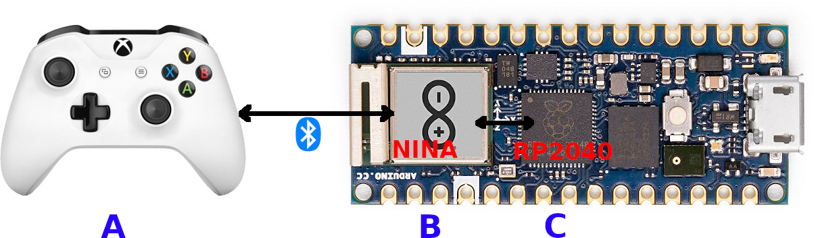

# Bluepad32 for NINA-W10 boards

!!! Warning

    **Deprecated**. Will be mantained until August 2024.
    Depends on 'SPI Flash Legacy' which was removed in ESP-IDF v5.0.

    Whenever possible use [Arduino + ESP32 platform][plat_arduino] instead, which has improved features.

## What is NINA-W10

NINA-W10 is series of [ESP32 modules][nina-esp32].
These module are present on some Arduino boards like:

- [Arduino Nano RP2040 Connect][nano_rp2040]
- [Arduino Nano 33 IoT][nano_33_iot]
- [Arduino MKR WiFi 1010][mkr_wifi]
- [Arduino UNO WiFi Rev.2][uni_wifi]
- [Arduino Arduino MKR Vidor 4000][mkr_vidor_4000]

NINA-W10 modules are co-processors, usually used only to bring WiFi or BLE to the main processor.

To have gamepad support, the original NINA-W10 firmware must be replaced
with Bluepad32 firmware. This is a simple step that needs to be done just once
and can be "undone" at any time.



This is how it works:

- Gamepad (A) talks to NINA-W10 module (B)
- NINA-W10 module (B) talks to the main processor (C)

Bluepad32 firmware is "compatible-enough" with the original firmware:

- It uses SPI, and the same GPIOs to talk to the main processor
- It uses the same protocol that runs on top of SPI
- But not all messages are implemented, and has some limitations:
    - :material-check: Only Bluepad32 features are implemented
    - :material-close: Bluepad32 logs cannot be seen
    - :material-close: Bluepad32 console not supported
    - :material-close: WiFi API is NOT supported
    - :material-close: BLE API is NOT supported (but BLE controllers ARE supported)


!!! Warning

    WiFi and Bluetooth APIs are not supported in NINA-W10 boards.


[nina-esp32]: https://www.u-blox.com/en/product/nina-w10-series-open-cpu

[nina-fw]: https://github.com/arduino/nina-fw

[nano_rp2040]: https://store-usa.arduino.cc/products/arduino-nano-rp2040-connect-with-headers

[nano_33_iot]: https://store-usa.arduino.cc/products/arduino-nano-33-iot

[mkr_wifi]: https://store-usa.arduino.cc/products/arduino-mkr-wifi-1010

[uni_wifi]: https://store-usa.arduino.cc/products/arduino-uno-wifi-rev2

[mkr_vidor_4000]: https://store.arduino.cc/products/arduino-mkr-vidor-4000

[plat_arduino]: ../plat_arduino

## Option A: Flashing pre-compiled Bluepad32 firmware

To flash Bluepad32 firmware, you have to:

### Download the latest pre-compiled Bluepad32 firmware for NINA-W10

Download latest binary from here: https://github.com/ricardoquesada/bluepad32/releases

- Download the file with "nina" in its name. E.g: `bluepad32-nina-x.y.z.tar.gz`
- Uncompress it using [7-zip][7zip], or from command line (`cmd.exe`):

```bat
tar -xf bluepad32-nina-x.y.z.tar.gz
cd bluepad32-nina-x.y.z
dir
```

- And you should see a file named `bluepad32-nina-x.y.z.bin` (or similar). You will use it later. Keep reading.

![uncompress][uncompress_bluepad32]

[7zip]: https://www.7-zip.org/

[uncompress_bluepad32]: https://lh3.googleusercontent.com/pw/ADCreHeyGuxiKj7l9EHBCHSbTasF12CVpZBWZEb30z-st1RqizDNGnt8V5hUNEr6JtYogH5ItDw2NmrTlxwe5ZZYk8_9K7mXM273QYOAQ8HE85eVP3NT0zTSP2JXjUlbt542osSy0VYOVUfr_ON9_bNfcHuDiA=w1153-h561-s-no-gm?authuser=0

### Download arduino-fwuploader

Download the latest binary from here: https://github.com/arduino/arduino-fwuploader/releases

### Select correct board name

* `arduino:samd:mkrwifi1010` for Arduino MKR WiFi 1010
* `arduino:samd:nano_33_iot` for Arduino NANO 33 IoT
* `arduino:samd:mkrvidor4000` for Arduino MKR Vidor 4000
* `arduino:megaavr:uno2018` for Arduino Uno WiFi Rev2
* `arduino:mbed_nano:nanorp2040connect` for Arduino Nano RP2040 Connect

You can see all boards names by doing:

```shell
$ arduino-fwuploader firmware list
```

### Flash it

#### Windows

You have to know:

- COM port: If you don't know which one it is, open Arduino IDE, and go to `Tools` -> `Port`: It should be something
  like `COM3`.
    - **VERY IMPORTANT**: Close Arduino IDE after that. The COM port must be "free". Nobody should be using it to flash
      the firmware.
- The board name: Choose the correct one from the list above

``` shell
arduino-fwuploader firmware flash -b arduino:mbed_nano:nanorp2040connect -a COM3 -i PATH\TO\bluepad32-nina-full.bin
```

![screenshot_flashing][screenshot_flashing]

[screenshot_flashing]: https://lh3.googleusercontent.com/pw/ADCreHf8I0rm8Di7YCIH0Q3IBVZa6zl9YcMdLUSnOQ00kSKCk4HSp2FsZ5h9tegByhpeqTcR0T_cD-9mpierf7M4zVc22BybTYdOIWCXnghDx_vFS5nv81oE9N2ocF0VDpu6vVIQGy_PfOqppYFHOrlGvWj7Cw=w1479-h327-s-no-gm?authuser=0

#### Linux & macOS

```shell
# Replace name and address with the correct ones
export BOARD=arduino:samd:nano_33_iot
export ADDRESS=/dev/ttyACM0
arduino-fwuploader firmware flash -b $BOARD -a $ADDRESS -i bluepad32-nina-full.bin
```

### Verify

To verify that the flash was successful, do:

```shell
$ arduino-fwuploader firmware get-version -b $BOARD -a $ADDRESS
```

And you should see:

```
...

Firmware version installed: Bluepad32 for NINA v3.6.0-rc0
```

## Option B: Flashing self-compiled Bluepad32 firmware

!!! Note

    If you already installed the pre-compiled firmware, skip this step

To flash self-compiled firmware, you should do:

1. Put the Arduino board in "pass-through" mode
2. Compile it yourself and flash it.

### 1. Put Arduino board in "passthrough" mode

Before flash Bluepad32 firmware, you have to put the Arduino board in "pass-through" mode:

1. Open Arduino IDE
2. Install the WiFiNINA library (just do it once)
3. And finally open the `SerialNINAPassthrough` sketch:

- File -> Examples -> WiFiNINA -> Tools -> SerialNINAPassthrough

Compile it and flash it to the Arduino board.

### 2. Compile it yourself and flash it

Install the requirements described here: [README.md][readme].

Chose `nina` as the target platform:

```sh
cd ${BLUEPAD32}/src

# Select Nina platform:
# Components config -> Bluepad32 -> Target Platform -> Nina
idf.py menuconfig

# And then compile it!
idf.py build
```

On Nano 32 IoT / MKR WIFI 1010, doing `idf.py flash` will just work.

```sh
# Only valid for:
#   * Nano 33 IoT
#   * MKR WIFI 1010

# Port might be different
export ESPPORT=/dev/ttyACM0

idf.py flash
```

But on NANO RP2040 Connect and UNO WiFi Rev.2, you have to flash it using the `--before no_reset` option,
and **NOT** `--before default_reset`. E.g:

```sh
# Only valid for:
#   * Nano RP2040 Connect
#   * UNO WiFi Rev.2

# Port might be different
export ESPPORT=/dev/ttyACM0

esptool.py --port ${ESPPORT} --baud 115200 --before no_reset write_flash 0x1000 ./build/bootloader/bootloader.bin 0x10000 ./build/bluepad32-airlift.bin 0x8000 ./build/partitions_singleapp.bin
```

[readme]: https://github.com/ricardoquesada/bluepad32/blob/main/README.md

## Install Arduino Library

You need to install the [Bluepad32-arduino][bluepad32_arduino_lib] library:

From Arduino Menu do: `Tools` -> `Manage Libraries...` -> Search for "bluepad32" and install it.

![bluepad32_arduino_library_image][bluepad32_arduino_library_image]

[bluepad32_arduino_lib]: https://github.com/ricardoquesada/bluepad32-arduino

[bluepad32_arduino_library_image]: https://lh3.googleusercontent.com/pw/AP1GczM-WtLavu39Va-__3hEPPwYIfHesXCZMjvjB_IFP6vYCGkxmZCbDUB4DEn1wSbNFD9_BTggW8v9zh4VDCSnt6qYg9XvL4yZqvBTLOkzN_dpam7YBrEXgrIyoBAHxyP_ruTLTaWNon75-4MQiTHf9zFaxg=-no-gm?authuser=0

## Example

After choosing your board, from Arduino Menu do: `File` -> `Examples` -> `Bluepad32` -> `Controller`

![bluepad32_arduino_example][bluepad32_arduino_example_image]

Compile it and flash it. Done! :smile:

!!! Note

    The board must be the regular Arduino board. E.g.: "Arduino Uno WiFi Rev2".
    And **NOT** any of the "esp32 + bluepad32" boards.

[bluepad32_arduino_example_image]: https://lh3.googleusercontent.com/pw/ABLVV85GvpUOL7J40Vc9utFUchorngX0ergZeuJgS0iiIOfSStcQLnDwP33S23QH_DsCHjs9U9lt0nRdfY3eyckitnN9ulZTZpKLaTFj2m97vf-XJIUgYSda5AhJyFWXDmGLaFJ2wPiS4xDftzecXE1VKVu2JA=-no-gm?authuser=0