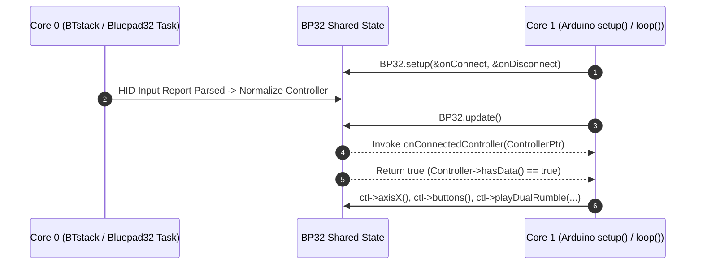

# Programmer's Guide: Arduino API

The Bluepad32 Arduino API (`<Bluepad32.h>`) provides an idiomatic, event-driven C++ interface for reading Bluetooth gamepads, mice, keyboards, and Wii Balance Boards on:

- **[ESP32 / ESP32-S3 / ESP32-C3 boards](../plat_arduino/)** (via the *ESP32 + Bluepad32* Arduino board package or ESP-IDF + Arduino template)
- **[Arduino NINA-W10 co-processor boards](../plat_nina/)** (Arduino Nano RP2040 Connect, Nano 33 IoT, MKR WiFi 1010, UNO WiFi Rev.2)

---

## 1. Execution Model & Lifecycle (`BP32`)

On ESP32, the Bluetooth stack (BTstack + Bluepad32 core) runs asynchronously on **Core 0**, while your Arduino `setup()` and `loop()` functions run on **Core 1**. The global `BP32` singleton bridges both cores safely:

1. **`BP32.setup(&onConnectedController, &onDisconnectedController)`**:
   Registers your connection and disconnection callbacks and initializes the Bluetooth host controller. Call this once inside `setup()`.
2. **`BP32.update()`**:
   Synchronizes the latest controller states from the Bluepad32 core and fires connection/disconnection callbacks when devices join or leave. Call this once per frame inside `loop()`, and check its boolean return value (`true` if new controller data arrived since the last call).



---

## 2. Complete Working Example

```cpp
#include <Bluepad32.h>

ControllerPtr myControllers[BP32_MAX_GAMEPADS];

// Invoked when a new Bluetooth controller finishes pairing/connecting
void onConnectedController(ControllerPtr ctl) {
    for (int i = 0; i < BP32_MAX_GAMEPADS; i++) {
        if (myControllers[i] == nullptr) {
            Serial.printf("CALLBACK: Controller connected, index=%d, model=%s\n",
                          i, ctl->getModelName().c_str());
            ControllerProperties properties = ctl->getProperties();
            Serial.printf("VID=0x%04x, PID=0x%04x, BTAddr=%02x:%02x:%02x:%02x:%02x:%02x\n",
                          properties.vendor_id, properties.product_id,
                          properties.btaddr[0], properties.btaddr[1], properties.btaddr[2],
                          properties.btaddr[3], properties.btaddr[4], properties.btaddr[5]);
            myControllers[i] = ctl;
            // Set player indicator LED to match slot index (1-based bitmask)
            ctl->setPlayerLEDs(1 << i);
            return;
        }
    }
    Serial.println("CALLBACK: Controller connected, but no empty slot available");
}

// Invoked when a controller disconnects
void onDisconnectedController(ControllerPtr ctl) {
    for (int i = 0; i < BP32_MAX_GAMEPADS; i++) {
        if (myControllers[i] == ctl) {
            Serial.printf("CALLBACK: Controller disconnected from index=%d\n", i);
            myControllers[i] = nullptr;
            return;
        }
    }
}

void processGamepad(ControllerPtr ctl) {
    // Analog sticks: normalized to [-511, 512]
    // Pedals (L2/brake, R2/throttle): normalized to [0, 1023]
    Serial.printf(
        "idx=%d, dpad=0x%02x, buttons=0x%04x, misc=0x%02x, "
        "LX=%4d, LY=%4d, RX=%4d, RY=%4d, brake=%4d, throttle=%4d\n",
        ctl->index(), ctl->dpad(), ctl->buttons(), ctl->miscButtons(),
        ctl->axisX(), ctl->axisY(), ctl->axisRX(), ctl->axisRY(),
        ctl->brake(), ctl->throttle());

    // Trigger a 250ms rumble burst when Cross / A (Bottom face button) is pressed
    if (ctl->a()) {
        ctl->playDualRumble(0 /* delayedStartMs */, 250 /* durationMs */,
                            0x80 /* weakMagnitude */, 0x40 /* strongMagnitude */);
    }

    // Cycle RGB lightbar when Triangle / X (Top face button) is pressed
    if (ctl->x()) {
        static uint8_t r = 255, g = 0, b = 128;
        ctl->setColorLED(r, g, b);
        r += 32;
        g += 64;
        b += 16;
    }
}

void setup() {
    Serial.begin(115200);
    Serial.printf("Bluepad32 Firmware: %s\n", BP32.firmwareVersion());

    // Initialize Bluepad32 and register connection lifecycle callbacks
    BP32.setup(&onConnectedController, &onDisconnectedController);

    // Optional: Enable virtual devices so DS4/DualSense touchpads appear as a separate Mouse
    BP32.enableVirtualDevice(false);
}

void loop() {
    // Poll Bluepad32; returns true if at least one controller updated
    bool dataUpdated = BP32.update();
    if (dataUpdated) {
        for (int i = 0; i < BP32_MAX_GAMEPADS; i++) {
            ControllerPtr ctl = myControllers[i];
            if (ctl && ctl->isConnected() && ctl->hasData()) {
                if (ctl->isGamepad()) {
                    processGamepad(ctl);
                }
            }
        }
    }
    delay(15);
}
```

---

## 3. Reading Controller Inputs (`ControllerPtr`)

### 3.1 Device Classification & Metadata

| Method | Return Type | Description |
| :--- | :--- | :--- |
| `ctl->isConnected()` | `bool` | Returns `true` if the Bluetooth link is active and ready. |
| `ctl->hasData()` | `bool` | Returns `true` if new input reports arrived during the last `BP32.update()`. |
| `ctl->index()` | `int` | Slot index (`0` to `BP32_MAX_GAMEPADS - 1`). |
| `ctl->isGamepad()` | `bool` | `true` if the device is a Gamepad (`UNI_CONTROLLER_CLASS_GAMEPAD`). |
| `ctl->isMouse()` | `bool` | `true` if the device is a Mouse (or virtual touchpad mouse). |
| `ctl->isKeyboard()` | `bool` | `true` if the device is a Keyboard (`UNI_CONTROLLER_CLASS_KEYBOARD`). |
| `ctl->isBalanceBoard()` | `bool` | `true` if the device is a Nintendo Wii Balance Board. |
| `ctl->getModelName()` | `String` | Human-readable controller model (e.g., `"DualSense"`, `"Switch Pro"`). |
| `ctl->getProperties()` | `ControllerProperties` | Struct containing `vendor_id`, `product_id`, `btaddr[6]`, `type`, `subtype`, and capability `flags`. |
| `ctl->battery()` | `uint8_t` | Battery level (`0` = empty, `254` = full, `255` = battery reporting unavailable). |

### 3.2 Gamepad Axes, Pedals, Buttons & IMU

Bluepad32 normalizes all gamepad layouts to a canonical Xbox/Nintendo/PlayStation positional layout regardless of vendor:

| Category | Method(s) | Range / Bitmask Constants |
| :--- | :--- | :--- |
| **Left Thumbstick** | `ctl->axisX()`, `ctl->axisY()` | `int32_t` in **`[-511, 512]`** (Right is `+X`, Down is `+Y`). |
| **Right Thumbstick** | `ctl->axisRX()`, `ctl->axisRY()` | `int32_t` in **`[-511, 512]`** (Right is `+RX`, Down is `+RY`). |
| **Analog Triggers** | `ctl->brake()` (L2), `ctl->throttle()` (R2) | `int32_t` in **`[0, 1023]`** (`0` = released, `1020`/`1023` = fully depressed). |
| **D-Pad** | `ctl->dpad()` | Bitmask of `DPAD_UP` (`0x01`), `DPAD_DOWN` (`0x02`), `DPAD_RIGHT` (`0x04`), `DPAD_LEFT` (`0x08`). |
| **Face Buttons** | `ctl->a()`, `ctl->b()`, `ctl->x()`, `ctl->y()`, `ctl->buttons()` | Positional helpers (`a()`=Bottom/Cross, `b()`=Right/Circle, `x()`=Left/Square, `y()`=Top/Triangle) or raw `BUTTON_A`..`BUTTON_THUMB_R` bitmask. |
| **Shoulder & Stick Clicks** | `ctl->l1()`, `ctl->r1()`, `ctl->l2()`, `ctl->r2()`, `ctl->thumbL()`, `ctl->thumbR()` | `bool` digital state for bumpers, digital triggers, and L3/R3 clicks. |
| **Misc / System Buttons** | `ctl->miscSystem()`, `ctl->miscSelect()`, `ctl->miscStart()`, `ctl->miscCapture()`, `ctl->miscButtons()` | `MISC_BUTTON_SYSTEM` (`0x01`), `MISC_BUTTON_SELECT` (`0x02`), `MISC_BUTTON_START` (`0x04`), `MISC_BUTTON_CAPTURE` (`0x08`). |
| **Gyroscope & Accelerometer** | `ctl->gyroX()`, `ctl->gyroY()`, `ctl->gyroZ()`, `ctl->accelX()`, `ctl->accelY()`, `ctl->accelZ()` | `int32_t` 3-axis angular velocity and linear acceleration (supported on DS4, DualSense, Switch Pro/Joy-Con, Wii). |

### 3.3 Mouse, Keyboard & Wii Balance Board

- **Mouse (`ctl->isMouse()`)**:
  - `ctl->deltaX()`, `ctl->deltaY()`: Relative cursor movement since last report (`int32_t`).
  - `ctl->scrollWheel()`: Vertical scroll wheel step (`int8_t`).
  - `ctl->buttons()`: Mouse button bitmask (`BUTTON_A` = Left click, `BUTTON_B` = Right click, `BUTTON_X` = Middle click).
- **Keyboard (`ctl->isKeyboard()`)**:
  - `ctl->isKeyPressed(KeyboardKey key)`: Checks if a specific USB HID keycode (e.g. `Keyboard_A`, `Keyboard_Spacebar`, `Keyboard_LeftShift`) is currently held down.
- **Wii Balance Board (`ctl->isBalanceBoard()`)**:
  - `ctl->topRight()`, `ctl->bottomRight()`, `ctl->topLeft()`, `ctl->bottomLeft()`: Calibrated load sensor readings (`uint16_t`, in grams/100g units).
  - `ctl->temperature()`: Internal board temperature reading (`int`).

---

## 4. Haptics, LEDs & Output Reports

- **Dual-Motor Rumble**:
  ```cpp
  ctl->playDualRumble(
      0,      // delayedStartMs: 0 to start immediately
      250,    // durationMs: duration in milliseconds (0 stops rumble)
      0x80,   // weakMagnitude: 0x00..0xFF (high-frequency motor)
      0xc0    // strongMagnitude: 0x00..0xFF (low-frequency motor)
  );
  ```
- **Player Indicator LEDs (Switch Pro, PS3, Wii, Xbox)**:
  ```cpp
  ctl->setPlayerLEDs(0x01); // 4-bit mask (bits 0..3 correspond to LEDs 1..4)
  ```
- **RGB Lightbar (DualShock 4, DualSense, PS Move)**:
  ```cpp
  ctl->setColorLED(0, 128, 255); // Red, Green, Blue (0..255)
  ```
- **Sony DualSense Adaptive Triggers (ESP-IDF + Arduino Template / Raw Parser Integration)**:
  When targeting ESP-IDF + Arduino on ESP32, DualSense adaptive trigger resistance effects (`feedback`, `weapon`, `vibration`, `off`) can be applied to the left (`L2`) and right (`R2`) triggers via `uni_hid_parser_ds5.h`:
  ```cpp
  #include "parser/uni_hid_parser_ds5.h"

  // Continuous resistance starting at position 2 with strength 6 (range 0..8; 0 turns effect off)
  ds5_adaptive_trigger_effect_t fx = ds5_new_adaptive_trigger_effect_feedback(2, 6);
  // Weapon trigger snap between position 2 and 6 with strength 8
  ds5_adaptive_trigger_effect_t weapon = ds5_new_adaptive_trigger_effect_weapon(2, 6, 8);
  // High-frequency trigger vibration at position 3, amplitude 5 (0..8), frequency 40 Hz
  ds5_adaptive_trigger_effect_t vib = ds5_new_adaptive_trigger_effect_vibration(3, 5, 40);
  ```

---

## 5. Bluetooth Scanning, Bonding & Allowlist Control

| `BP32` / `Controller` / `uni_bt_allowlist` Method | Description |
| :--- | :--- |
| `BP32.enableNewConnections(bool enabled)` | Starts (`true`) or stops (`false`) Bluetooth inquiry/advertising scans for new controllers. Previously bonded controllers can still reconnect when `false`. |
| `BP32.forgetBluetoothKeys()` | Erases all stored Classic BT and BLE link keys from non-volatile flash (NVS). Call this if a controller was re-paired to a PC/console and needs a fresh bonding handshake. |
| `BP32.enableVirtualDevice(bool enabled)` | Enables or disables automatic creation of a second `ControllerPtr` (Mouse) for composite gamepads with touchpads (DualShock 4 / DualSense). Must be called before connecting the controller. |
| `BP32.enableBLEService(bool enabled)` | Enables or disables the Bluepad32 BLE GATT configuration/telemetry service. |
| `ctl->disconnect()` | Gracefully disconnects a specific active controller slot. |
| `uni_bt_allowlist_add_addr(bd_addr_t addr)` / `uni_bt_allowlist_set_enabled(bool enabled)` | Restricts incoming and outgoing Bluetooth connections to an explicit NVS-persisted list of 6-byte MAC addresses (`#include <bt/uni_bt_allowlist.h>`). |


