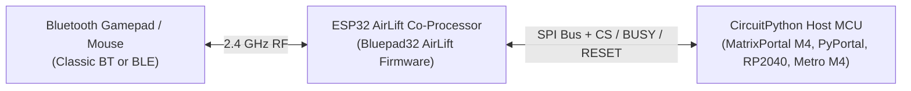

# Programmer's Guide: CircuitPython API

The [bluepad32-circuitpython][bp32_cp_repo] library allows CircuitPython boards equipped with an **ESP32 AirLift co-processor** (flashed with the [Bluepad32 AirLift firmware](../plat_airlift/)) to read Bluetooth gamepads, mice, and balance boards over SPI.

---

## 1. Co-Processor Architecture & SPI Wiring

In a CircuitPython AirLift setup, the ESP32 AirLift module runs the real-time Bluetooth stack (`BTstack` + `Bluepad32` NINA/AirLift SPI-slave driver on `GPIO_MOSI=14`, `GPIO_MISO=23`, `GPIO_SCLK=18`, `GPIO_CS=5`, `GPIO_READY=33`), while your host microcontroller (SAMD51, RP2040, nRF52840, or i.MX RT) runs CircuitPython (`code.py`) and polls the AirLift co-processor over SPI.



### Pin Mapping (Integrated Boards vs. External Breakout)

- **Integrated AirLift Boards** (Adafruit MatrixPortal M4, PyPortal, PyBadge, Metro M4 Express AirLift):
  Use the built-in `board.ESP_CS`, `board.ESP_BUSY`, `board.ESP_RESET`, and `board.SPI()` definitions directly.
- **External AirLift Breakout Wiring**:

| Signal | ESP32 AirLift GPIO | CircuitPython Host Pin (Example) | Description |
| :--- | :--- | :--- | :--- |
| **MOSI** | `GPIO 14` | `board.MOSI` | SPI Controller Out, Peripheral In |
| **MISO** | `GPIO 23` | `board.MISO` | SPI Controller In, Peripheral Out |
| **SCK** | `GPIO 18` | `board.SCK` | SPI Clock |
| **CS** | `GPIO 5` | `board.ESP_CS` (or `board.D10`) | Active-low Chip Select |
| **BUSY / READY** | `GPIO 33` | `board.ESP_BUSY` (or `board.D9`) | Handshake ready line from ESP32 |
| **RESET** | `EN` | `board.ESP_RESET` (or `board.D6`) | Hardware reset line to ESP32 |

---

## 2. Installation & Complete Working Example (`code.py`)

1. Ensure your AirLift module is flashed with the [Bluepad32 AirLift firmware](../plat_airlift/).
2. Copy the `bluepad32` package directory from [bluepad32-circuitpython][bp32_cp_repo] into the `lib/` folder on your `CIRCUITPY` drive, alongside `adafruit_bus_device`.
3. Save the following script as `code.py` on your `CIRCUITPY` drive:

```python
import time
import board
import busio
from digitalio import DigitalInOut
from bluepad32.bluepad32 import Bluepad32

# Use built-in ESP pins on MatrixPortal / PyPortal / Metro M4 AirLift,
# or fall back to external breakout pins (D10, D9, D6).
esp_cs = DigitalInOut(getattr(board, "ESP_CS", board.D10))
esp_busy = DigitalInOut(getattr(board, "ESP_BUSY", board.D9))
esp_reset = DigitalInOut(getattr(board, "ESP_RESET", board.D6))

spi = busio.SPI(board.SCK, board.MOSI, board.MISO)
bp32 = Bluepad32(spi, esp_cs, esp_busy, esp_reset, debug=False)

# Configure the protocol callbacks and verify firmware version
bp32.setup_callbacks()
print("Bluepad32 Firmware Version:", bp32.firmware_version)

# Enable scanning for new Bluetooth controllers
bp32.enable_new_connections(True)

while True:
    # Poll connected controllers from the ESP32 co-processor over SPI
    for gp in bp32.connected_controllers:
        if gp is None:
            continue

        # Print normalized thumbsticks ([-511, 512]), triggers ([0, 1023]), and buttons
        print(
            f"dpad={gp.dpad:#04x} btns={gp.buttons:#06x} "
            f"LX={gp.axis_x:4d} LY={gp.axis_y:4d} "
            f"RX={gp.axis_rx:4d} RY={gp.axis_ry:4d} "
            f"L2={gp.brake:4d} R2={gp.throttle:4d}"
        )

        # Trigger haptic rumble and cycle lightbar LED when button A (bit 0) is pressed
        if gp.buttons & 0x01:
            gp.set_player_leds(0x01)
            gp.set_lightbar_color(0, 128, 255)
            gp.play_dual_rumble(
                delayed_start_ms=0,
                duration_ms=200,
                weak_magnitude=0x80,
                strong_magnitude=0x40,
            )

    time.sleep(0.03)
```

---

## 3. Controller Properties & Input Attributes

Each active controller returned by `bp32.connected_controllers` exposes normalized input fields matching the wire format defined in `uni_platform_nina.c`:

| Attribute / Method | Type / Range | Description |
| :--- | :--- | :--- |
| `gp.dpad` | `int` (`0x00..0x0F`) | Bitmask: `0x01` Up, `0x02` Down, `0x04` Right, `0x08` Left. |
| `gp.axis_x`, `gp.axis_y` | `int` (`-511..512`) | Left analog stick horizontal (`+` right) and vertical (`+` down) axes. |
| `gp.axis_rx`, `gp.axis_ry` | `int` (`-511..512`) | Right analog stick horizontal (`+` right) and vertical (`+` down) axes. |
| `gp.brake`, `gp.throttle` | `int` (`0..1023`) | Analog left trigger (`L2`) and right trigger (`R2`). |
| `gp.buttons` | `int` (`uint16`) | Face, shoulder, and thumb-click bitmask (`0x0001`=A, `0x0002`=B, `0x0004`=X, `0x0008`=Y, `0x0010`=L1, `0x0020`=R1, `0x0040`=L2, `0x0080`=R2, `0x0100`=ThumbL, `0x0200`=ThumbR). |
| `gp.misc_buttons` | `int` (`uint8`) | System button bitmask (`0x01`=System/Home, `0x02`=Select/Share, `0x04`=Start/Options, `0x08`=Capture). |
| `gp.gyro` | `(int, int, int)` | 3-axis gyroscope tuple `(gx, gy, gz)`. |
| `gp.accel` | `(int, int, int)` | 3-axis accelerometer tuple `(ax, ay, az)`. |
| `gp.set_player_leds(mask)` | Method | Sets the 4-bit player indicator LED mask (`0x00..0x0F`). |
| `gp.set_lightbar_color(r, g, b)` | Method | Sets the RGB lightbar color (`0..255` per channel) on DualShock 4 / DualSense. |
| `gp.play_dual_rumble(...)` | Method | Triggers dual-motor haptic vibration (`delayed_start_ms`, `duration_ms`, `weak_magnitude`, `strong_magnitude`). |

---

## 4. Troubleshooting

1. **`RuntimeError: Failed to timed out waiting for ESP32 READY` or Invalid Firmware Version**:
   - Verify that your ESP32 co-processor has been flashed with **`Bluepad32 for AirLift`** (and *not* stock Adafruit NINA-fw or Arduino NINA firmware, which uses `GPIO 12` instead of `GPIO 14` for MOSI).
   - Check that `esp_cs`, `esp_busy`, and `esp_reset` match your board's physical wiring.
2. **Controller Does Not Re-Pair After Connecting to Another Host**:
   - Call `bp32.forget_bluetooth_keys()` once during startup to clear stored link keys from the ESP32 NVS partition, then put your controller into Bluetooth pairing mode.

[bp32_cp_repo]: https://github.com/ricardoquesada/bluepad32-circuitpython

