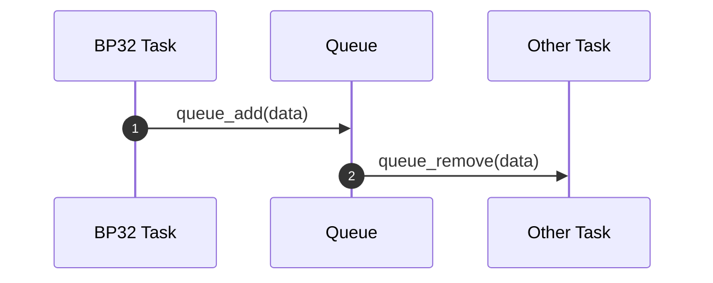

# Programmer's Guide: Raw API

WIP

Valid when using Pico-SDK / ESP-IDF directly. E.g.: If your project is based on any of these examples, then you are
using the "Raw API":

- [ESP32 example][esp32_example] (uses "Raw API")
- [Pico W example][picow_example] (uses "Raw API")
- [Posix example][posix_example] (uses "Raw API")

## Multithreading

!!! note "TL;DR"

    Bluepad32 / BTstack are **NOT** multithreaded.
    Only call Bluepad32 and BTstack APIs from the BTstack thread.

### What's safe to call from BTstack thread

The BTstack thread (or BTstack task) is where BTstack and Bluepad32 run.

The Bluepad32 and BTstack *callbacks* run in the BTstack thread. E.g.:

- Bluepad32 platform callbacks like: `platform.on_controller_data()` or `platform.on_device_connected()`
- BTstack callbacks like the packet handlers, e.g: `l2cap_packet_handler()`

It is safe to call any Bluepad32 API (usually they start with `uni_` prefix),
or any BTstack API (usually they start with `bstack_` prefix) from any of the above-mentioned callbacks.

### What's safe to call from anywhere

- BTstack's `btstack_run_loop_execute_on_main_thread()`: schedules a callback that runs in BTstack thread.
- Bluepad32's functions that have the `_safe` suffix like `uni_bt_enable_new_connections_safe()`
- A handful of Bluepad32 functions that are not related to BTstack. TODO: document them.

### What's NOT safe to call from anywhere

The rest.

If your code is **NOT** running in the BTstack thread don't call any Bluepad32 / BTstack function,
except the ones mentioned above.

### Details

- Bluepad32 is NOT multithreaded.
- BTstack (Bluetooth stack used by Bluepad32) is NOT multithreaded.

If you call any Bluepad32 or BTstack function from a different core or different task other than the BTstack thread,
your program:

- might crash at random places (very likely)
- might not do what you want
- of if you are extremely lucky, it might work... sometimes.

From [BTstack documentation][btstack_multithreading]

> BTstack is not thread-safe, but you're using a multi-threading OS.
> Any function that is called from BTstack, e.g., packet handlers, can directly call into BTstack without issues.
> For other situations, you need to provide some general 'do BTstack tasks' function and trigger BTstack to execute
> it on its own thread. To call a function from the BTstack thread, you can
> use `btstack_run_loop_execute_on_main_thread()`
> allows to directly schedule a function callback, i.e. 'do BTstack tasks' function, from the BTstack thread.
> The called function should check if there are any pending BTstack tasks and execute them.

### Example

Let's say that you want to enable rumble from a function that is NOT running on the BTstack thread (task).

```c
static btstack_context_callback_registration_t callback_registration;

// Safe to call any Bluepad32 / BTstack from this callback function
static void on_enable_rumble(void* context) {
    uni_hid_device_t* d;
    int idx = (int)context;

    d = uni_hid_device_get_instance_for_idx(idx);

    // Safety checks in case the gamepad got disconnected while the callback was scheduled
    if (!d) return;
    if (!uni_bt_conn_is_connected(&d->conn)) return;

    if (d->report_parser.play_dual_rumble != NULL)
        d->report_parser.play_dual_rumble(d, 0, 0, 0x80, 0x80);
}

// My Task is a FreeRTOS task, meaning that it is not running on the BTstack thread (task)
// So it cannot call any Bluepad32 / BTstack function,
// except "btstack_run_loop_execute_on_main_thread()"
void my_task() {
    ...
    if (need_to_play_rumble) {
        callback_registration.callback = &on_enable_rumble;
        callback_registration.context = (void*)(gamepad_idx);
        btstack_run_loop_execute_on_main_thread(&callback_registration);
    }
}
```

[btstack_multithreading]: https://github.com/bluekitchen/btstack/blob/master/port/esp32/README.md#multi-threading

[esp32_example]: https://github.com/ricardoquesada/bluepad32/tree/main/examples/esp32

[picow_example]: https://github.com/ricardoquesada/bluepad32/tree/main/examples/pico_w

[posix_example]: https://github.com/ricardoquesada/bluepad32/tree/main/examples/posix

## BTstack / Bluepad32 callbacks

!!! note "TL;DR"

    Don't call `printf()` / `logi()` or any other "expensive" function from the BTstack thread.

Do not execute expensive functions from any of the BTstack / Bluepad32 callbacks. They run on the BTstack thread,
and you should return as fast as possible from those functions.

Best practices:

1. Don't call `printf()` / `logi()` that frequent from those calls.
   Ok to have them for debug purposes, but remove them once you know your code works Ok.
2. Return as fast as possible. Don't do "expensive" operations there.
3. If you need to do an expensive operation, offload it to a different thread. See the next section.

### Offloading expensive operation to a different task

There are different communication channels to connect two tasks. A simple and effective way to do it is by using a queue.



Documentation:

* [Pico SDK Queue]
* [FreeRTOS Queue management], for ESP-IDF.

Examples:

* For Pico SDK: [multicore_runner_queue.c]
* For ESP-IDF: [twai_network_example_master_main.c]


[multicore_runner_queue.c]: https://github.com/raspberrypi/pico-examples/blob/master/multicore/multicore_runner_queue/multicore_runner_queue.c
[twai_network_example_master_main.c]: https://github.com/espressif/esp-idf/blob/master/examples/peripherals/twai/twai_network/twai_network_master/main/twai_network_example_master_main.c
[Pico SDK Queue]: https://www.raspberrypi.com/documentation/pico-sdk/group__queue.html
[FreeRTOS Queue management]: https://www.freertos.org/a00018.html
