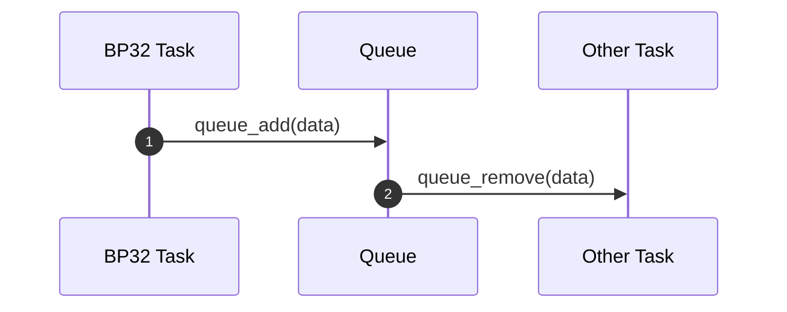

# Programmer's Guide: Raw API

Valid when using Pico-SDK, ESP-IDF, or POSIX directly. If your project is based on any of these examples, then you are
using the "Raw API":

- [ESP32 example][esp32_example] (uses "Raw API")
- [Pico W example][picow_example] (uses "Raw API")
- [Posix example][posix_example] (uses "Raw API")

## Multithreading

!!! note "TL;DR"

    Bluepad32 / BTstack are **NOT** multithreaded.
    Only call Bluepad32 and BTstack APIs from the BTstack thread, or use the designated `*_safe` cross-thread wrappers.

### What's safe to call from BTstack thread

The BTstack thread (or BTstack task) is where BTstack and Bluepad32 run.

The Bluepad32 and BTstack *callbacks* run in the BTstack thread. E.g.:

- Bluepad32 platform callbacks like: `platform.on_controller_data()`, `platform.on_device_connected()`, `platform.on_device_ready()`, `platform.on_device_disconnected()`, or `platform.on_init_complete()`
- BTstack callbacks like the packet handlers (`l2cap_packet_handler()`) or `btstack_run_loop_execute_on_main_thread()` callbacks

It is safe to call any Bluepad32 API (functions starting with the `uni_` prefix, including `*_unsafe` functions)
or any BTstack API (functions starting with the `btstack_`, `gap_`, `hci_`, `l2cap_`, or `gatt_` prefixes) from any of the above-mentioned callbacks.

### What's safe to call from anywhere

- BTstack's `btstack_run_loop_execute_on_main_thread()`: schedules a `btstack_context_callback_registration_t` callback to run sequentially on the BTstack thread.
- Bluepad32's functions that have the `_safe` suffix, such as `uni_bt_start_scanning_and_autoconnect_safe()`, `uni_bt_stop_scanning_safe()`, `uni_bt_del_keys_safe()`, or `uni_bt_disconnect_device_safe()`.
- Stateless/atomic query helpers and pure data-conversion utilities documented in the reference table below.

### Bluepad32 API & Thread Safety (`*_safe` vs `*_unsafe`)

Bluepad32 provides explicit `_safe` and `_unsafe` variants for Bluetooth management operations in `bt/uni_bt.h`:

| Operation / Purpose | Cross-Thread Safe API (Any FreeRTOS Task / Core / ISR Context) | BTstack-Thread Only API (Platform Callbacks / Run-Loop Context) | Notes & Implementation Semantics |
| :--- | :--- | :--- | :--- |
| **Start Scanning & Autoconnect** | `uni_bt_start_scanning_and_autoconnect_safe(void)` | `uni_bt_start_scanning_and_autoconnect_unsafe(void)` | Starts Classic BT inquiry and/or BLE scanning (`CMD_BT_START_SCANNING`). |
| **Stop Scanning** | `uni_bt_stop_scanning_safe(void)` | `uni_bt_stop_scanning_unsafe(void)` | Stops active Classic BT inquiry and BLE scanning (`CMD_BT_STOP_SCANNING`). |
| **Enable/Disable New Connections (Deprecated)** | `uni_bt_enable_new_connections_safe(bool enabled)` | `uni_bt_enable_new_connections_unsafe(bool enabled)` | Wrapper around `start_scanning_and_autoconnect` / `stop_scanning`. |
| **Delete Stored Bluetooth Bonding Keys** | `uni_bt_del_keys_safe(void)` | `uni_bt_del_keys_unsafe(void)` | Deletes Classic BT and BLE link keys from NVS/TLV (`CMD_BT_DEL_KEYS`). |
| **List Stored Bluetooth Bonding Keys** | `uni_bt_list_keys_safe(void)` | `uni_bt_list_keys_unsafe(void)` | Logs bonded Classic BT and BLE link keys (`CMD_BT_LIST_KEYS`). |
| **Disconnect & Delete a Controller** | `uni_bt_disconnect_device_safe(int device_idx)` | `uni_hid_device_disconnect(d)` + `uni_hid_device_delete(d)` | `_safe` encodes `device_idx` in the upper 16 bits of `context` (`CMD_DISCONNECT_DEVICE`). |
| **Dump Connected Devices to Console** | `uni_bt_dump_devices_safe(void)` | `uni_hid_device_dump_all(void)` | Prints all active `uni_hid_device_t` instances (`CMD_DUMP_DEVICES`). |
| **Enable/Disable BLE Config Service** | `uni_bt_enable_service_safe(bool enabled)` | `uni_bt_service_set_enabled(bool enabled)` | Toggles the BLE GATT telemetry/configuration service (`CMD_BLE_SERVICE_ENABLE`/`DISABLE`). |
| **Read Local Bluetooth MAC Address** | `uni_bt_get_local_bd_addr_safe(bd_addr_t addr)` | `memcpy(addr, uni_local_bd_addr, 6)` | Copies the cached 6-byte local `bd_addr_t`. |
| **Query Scanning / Incoming Flags** | `uni_bt_is_scanning(void)`, `uni_bt_incoming_connections_is_allowed(void)`, `uni_bt_allow_incoming_connections(bool)` | Same | Reads/writes boolean flags (`bt_scanning_enabled`, `bt_allow_incoming_connections`). |
| **Pure Controller Remapping / Joystick Math** | `uni_gamepad_remap(...)`, `uni_joy_to_single_joy_from_gamepad(...)`, `uni_joy_to_twinstick_from_gamepad(...)` | Same | Pure functions operating on caller-owned structs; safe on any thread if structs are not shared concurrently. |
| **Device Lookup & Haptics / LEDs** | *Must schedule via `btstack_run_loop_execute_on_main_thread()`* | `uni_hid_device_get_instance_for_idx(idx)`, `d->report_parser.play_dual_rumble(...)`, `d->report_parser.set_player_leds(...)`, `d->report_parser.set_lightbar_color(...)` | Mutates `uni_hid_device_t` state and queues L2CAP/GATT output reports; **must only execute on the BTstack thread**. |

#### The `CMD_CALLBACK_MAX = 8` Ring-Buffer Constraint

Internally, every `uni_bt_*_safe()` function allocates a `btstack_context_callback_registration_t` entry from a static 8-slot circular array (`cmd_callback_registration[CMD_CALLBACK_MAX]` where `CMD_CALLBACK_MAX = 8` in `src/components/bluepad32/bt/uni_bt.c`) and schedules it via `btstack_run_loop_execute_on_main_thread()`.

!!! warning "Do not burst more than 8 `_safe()` calls per BTstack run-loop tick"

    Because BTstack links `btstack_context_callback_registration_t` structs into an intrusive singly-linked list until the BTstack thread drains the queue, calling `uni_bt_*_safe()` more than **8 times** before the BTstack thread executes a run-loop iteration will wrap `cmd_callback_idx` around the ring buffer and overwrite a pending registration node. Always coalesce or rate-limit external task commands to fewer than 8 pending calls per frame.

### What's NOT safe to call from anywhere

Any function not listed in the cross-thread column above.

If your code is **NOT** running in the BTstack thread, do not call `uni_hid_device_*`, `uni_bt_*_unsafe`, `d->report_parser.*`, or raw BTstack functions directly. Instead, use the `_safe` wrapper or schedule your callback with `btstack_run_loop_execute_on_main_thread()`.

### Details

- Bluepad32 is NOT multithreaded.
- BTstack (Bluetooth stack used by Bluepad32) is NOT multithreaded.

If you call any Bluepad32 or BTstack function from a different core or different task other than the BTstack thread,
your program:

- might crash at random places (very likely)
- might not do what you want
- or if you are extremely lucky, it might work... sometimes.

From [BTstack documentation][btstack_multithreading]

> BTstack is not thread-safe, but you're using a multi-threading OS.
> Any function that is called from BTstack, e.g., packet handlers, can directly call into BTstack without issues.
> For other situations, you need to provide some general 'do BTstack tasks' function and trigger BTstack to execute
> it on its own thread. To call a function from the BTstack thread, you can
> use `btstack_run_loop_execute_on_main_thread()`
> allows to directly schedule a function callback, i.e. 'do BTstack tasks' function, from the BTstack thread.
> The called function should check if there are any pending BTstack tasks and execute them.

### Example

Let's say that you want to enable rumble from a function that is NOT running on the BTstack thread (task).

```c
static btstack_context_callback_registration_t callback_registration;

// Safe to call any Bluepad32 / BTstack from this callback function
static void on_enable_rumble(void* context) {
    uni_hid_device_t* d;
    int idx = (int)context;

    d = uni_hid_device_get_instance_for_idx(idx);

    // Safety checks in case the gamepad got disconnected while the callback was scheduled
    if (!d) return;
    if (!uni_bt_conn_is_connected(&d->conn)) return;

    if (d->report_parser.play_dual_rumble != NULL)
        d->report_parser.play_dual_rumble(d, 0, 0, 0x80, 0x80);
}

// My Task is a FreeRTOS task, meaning that it is not running on the BTstack thread (task)
// So it cannot call any Bluepad32 / BTstack function,
// except "btstack_run_loop_execute_on_main_thread()"
void my_task() {
    ...
    if (need_to_play_rumble) {
        callback_registration.callback = &on_enable_rumble;
        callback_registration.context = (void*)(gamepad_idx);
        btstack_run_loop_execute_on_main_thread(&callback_registration);
    }
}
```

[btstack_multithreading]: https://github.com/bluekitchen/btstack/blob/master/port/esp32/README.md#multi-threading

[esp32_example]: https://github.com/ricardoquesada/bluepad32/tree/main/examples/esp32

[picow_example]: https://github.com/ricardoquesada/bluepad32/tree/main/examples/pico_w

[posix_example]: https://github.com/ricardoquesada/bluepad32/tree/main/examples/posix

## BTstack / Bluepad32 callbacks

!!! note "TL;DR"

    Don't call `printf()` / `logi()` or any other "expensive" function from the BTstack thread.

Do not execute expensive functions from any of the BTstack / Bluepad32 callbacks. They run on the BTstack thread,
and you should return as fast as possible from those functions.

Best practices:

1. Don't call `printf()` / `logi()` that frequent from those calls.
   Ok to have them for debug purposes, but remove them once you know your code works Ok.
2. Return as fast as possible. Don't do "expensive" operations there.
3. If you need to do an expensive operation, offload it to a different thread. See the next section.

### Offloading expensive operation to a different task

There are different communication channels to connect two tasks. A simple and effective way to do it is by using a queue.


```mermaid
sequenceDiagram
  autonumber
  BP32 Task->>Queue: queue_add(data);
  Queue->>Other Task: queue_remove(data);
```

Documentation:

* [Pico SDK Queue]
* [FreeRTOS Queue management], for ESP-IDF.

Examples:

* For Pico SDK: [multicore_runner_queue.c]
* For ESP-IDF: [twai_network_example_master_main.c]


[multicore_runner_queue.c]: https://github.com/raspberrypi/pico-examples/blob/master/multicore/multicore_runner_queue/multicore_runner_queue.c
[twai_network_example_master_main.c]: https://github.com/espressif/esp-idf/blob/master/examples/peripherals/twai/twai_network/twai_network_master/main/twai_network_example_master_main.c
[Pico SDK Queue]: https://www.raspberrypi.com/documentation/pico-sdk/group__queue.html
[FreeRTOS Queue management]: https://www.freertos.org/a00018.html
